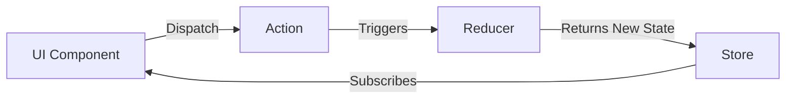

# Introduction to Redux

## Table of Contents
1. [Introduction](#1-introduction)
2. [Why Redux?](#2-why-redux)
3. [Core Principles](#3-core-principles)
4. [Redux Flow](#4-redux-flow)
5. [Key Concepts](#5-key-concepts)
6. [Quick Reference](#6-quick-reference)
7. [Interview Questions](#7-interview-questions)

---

## 1. Introduction

### 1.1 What is Redux?
**Redux** is a predictable state container for JavaScript apps. It helps you write applications that behave consistently, run in different environments (client, server, and native), and are easy to test.

### 1.2 Relationship with React
Redux can be used with any JS library (Angular, Vue, etc.), but it is most commonly used with React using the `react-redux` binding library.

---

## 2. Why Redux?

### 2.1 The Prop Drilling Problem
In large applications, passing state down through many layers of components (Prop Drilling) becomes unmanageable.

### 2.2 Global State Management
Redux provides a single **Store** (global object) for the whole application state. Components can access this state directly or update it, regardless of where they are in the component tree.

---

## 3. Core Principles

Redux is based on three fundamental principles:

1.  **Single Source of Truth**: The state of your whole application is stored in an object tree within a single **store**.
2.  **State is Read-Only**: The only way to change the state is to emit an **action**, an object describing what happened. You never modify state directly.
3.  **Changes are made with Pure Functions**: To specify how the state tree is transformed by actions, you write **reducers**. Reducers are pure functions `(previousState, action) => newState`.

---

## 4. Redux Flow

The data flow in Redux is **unidirectional**.



1.  **View**: User clicks a button.
2.  **Action**: Component dispatches an Action (e.g., `{ type: 'INCREMENT' }`).
3.  **Reducer**: Function receives current state and action, calculates new state.
4.  **Store**: Updates with new state.
5.  **View**: React detects change and re-renders with new data.

---

## 5. Key Concepts

### 5.1 Store
The object that holds the application state.
- `store.getState()`: Access state
- `store.dispatch(action)`: Update state
- `store.subscribe(listener)`: Listen for changes

### 5.2 Action
A plain JavaScript object that describes **what happened**. Must have a `type` property.

```javascript
const addAction = {
    type: 'ADD_TODO',
    text: 'Learn Redux'
};
```

### 5.3 Reducer
A pure function that takes the **previous state** and an **action**, and returns the **next state**.

```javascript
// (prevState, action) => newState
function counterReducer(state = { count: 0 }, action) {
    switch (action.type) {
        case 'INCREMENT':
            return { count: state.count + 1 };
        case 'DECREMENT':
            return { count: state.count - 1 };
        default:
            return state;
    }
}
```

---

## 6. Quick Reference

| Term | Definition |
|------|------------|
| **Store** | Holds state |
| **Action** | Describes "What happened" (`{type: '...'}`) |
| **Reducer** | Logic to change state `(state, action) => newState` |
| **Dispatch** | Method to send action to store |
| **Subscription** | Notification of state change |

---

## 7. Interview Questions

### Q1: What are the three core principles of Redux?
**Answer**:
1. Single Source of Truth (One store).
2. State is Read-Only (emit actions to change).
3. Changes are made with Pure Functions (Reducers).

### Q2: What is a Reducer in Redux?
**Answer**: A reducer is a pure function that determines how the application's state changes in response to an action sent to the store. It matches `(previousState, action) => newState`.

### Q3: Why is immutability important in Redux?
**Answer**: Redux relies on shallow equality checking to determine if state has changed. If you mutate the state object directly (e.g., `state.count++`), Redux won't detect the change, and the UI won't re-render. You must always return a new object (e.g., `return { ...state, count: state.count + 1 }`).

### Q4: Can we have multiple Stores in Redux?
**Answer**: The standard Redux design pattern recommends a **single store**. If you need to separate data handling, you use **multiple reducers** combined into a root reducer using `combineReducers`.

---

## Navigation

← Previous: [53_Lazy_Loading.md](./53_Lazy_Loading.md) | Next: [55_useReducer_Hook.md](./55_useReducer_Hook.md) →

---

*Source: CDAC PG-DAC Web Programming Technologies Course - Day 11*
