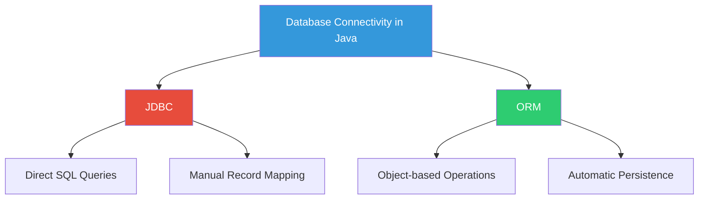
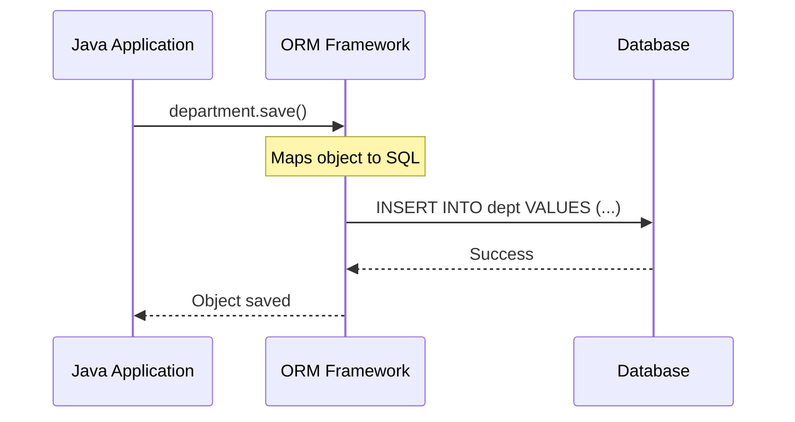
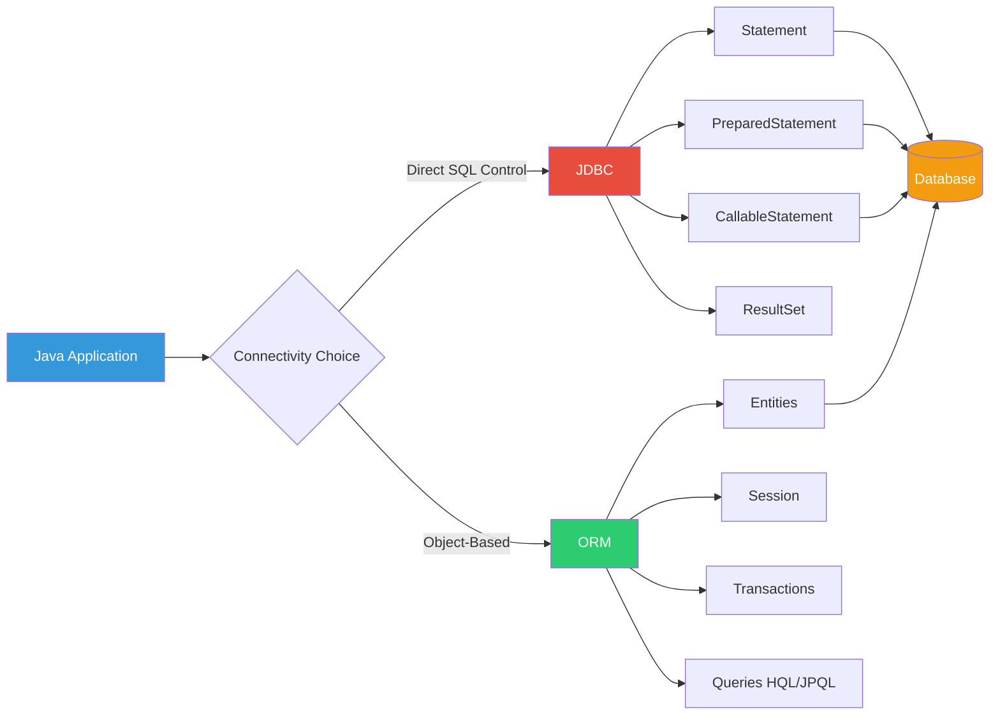

# 01 - Introduction to Database Connectivity in Java

## Table of Contents
1. [Overview](#overview)
2. [Database Connectivity Approaches](#database-connectivity-approaches)
3. [JDBC - Java Database Connectivity](#jdbc---java-database-connectivity)
4. [ORM - Object Relational Mapping](#orm---object-relational-mapping)
5. [When to Use JDBC vs ORM](#when-to-use-jdbc-vs-orm)
6. [Key Takeaways](#key-takeaways)

---

## Overview

**Database connectivity** is a fundamental requirement for enterprise applications. Java applications need to interact with databases to perform operations like:
- 📊 Retrieving records (SELECT)
- 📝 Updating records (UPDATE)
- ➕ Adding new records (INSERT)
- ❌ Deleting records (DELETE)

Java provides **two main approaches** for database connectivity:
1. **JDBC** (Java Database Connectivity)
2. **ORM** (Object Relational Mapping)

---

## Database Connectivity Approaches

### The Two Paradigms



---

## JDBC - Java Database Connectivity

### What is JDBC?

**JDBC** is a standard Java API that enables Java applications to interact with relational databases using SQL queries.

### Core Capabilities

JDBC allows you to:

| Operation | Description | SQL Command |
|-----------|-------------|-------------|
| **Retrieve** | Fetch records from database | `SELECT` |
| **Update** | Modify existing records | `UPDATE` |
| **Add** | Insert new records | `INSERT` |
| **Delete** | Remove records | `DELETE` |

### How JDBC Works

1. **Write SQL queries** explicitly in your Java code
2. **Execute queries** using JDBC API
3. **Process results** manually by iterating through ResultSet
4. **Map data** from ResultSet to Java objects manually

### Example Concept

```java
// JDBC approach - Manual SQL and mapping
String query = "SELECT * FROM dept WHERE deptno = ?";
PreparedStatement pst = connection.prepareStatement(query);
pst.setInt(1, 10);
ResultSet rs = pst.executeQuery();
while(rs.next()) {
    int deptNo = rs.getInt("deptno");          // Manual extraction
    String deptName = rs.getString("dname");    // Manual extraction
    String location = rs.getString("loc");      // Manual extraction
    // Create object manually
    Department dept = new Department(deptNo, deptName, location);
}
```

### Characteristics of JDBC

✅ **Advantages**:
- Direct control over SQL
- Fine-grained performance tuning
- Lightweight and fast for simple operations
- No learning curve for SQL experts
- Suitable for stored procedures and complex queries

❌ **Disadvantages**:
- **Verbose code** - lots of boilerplate
- **Manual mapping** - you must convert ResultSet to objects
- **Database-specific** - SQL may vary between databases
- **Maintenance overhead** - changes in table structure require code changes

---

## ORM - Object Relational Mapping

### What is ORM?

**ORM** (Object Relational Mapping) is a technique that allows you to work with database records as if they were regular Java objects. The framework handles the SQL generation and data mapping automatically.

### Core Concept

> **ORM bridges the gap between Object-Oriented Programming and Relational Databases**

Instead of writing SQL queries, you:
1. **Define Java classes** that represent database tables
2. **Work with objects** using regular Java code
3. **Let the ORM framework** handle SQL generation and execution

### Popular ORM Frameworks

- **Hibernate** (most popular)
- **JPA** (Java Persistence API - specification)
- **EclipseLink**
- **MyBatis** (semi-ORM)

### How ORM Works



### Example Concept

```java
// ORM approach - Object-based operations
// No SQL written, framework handles it
Department dept = new Department();
dept.setDeptNo(10);
dept.setDeptName("Accounting");
dept.setLocation("New York");

// Just save the object - ORM generates SQL automatically
session.save(dept);  // Hibernate automatically creates INSERT query
```

### Object Persistence

> **We can persist and retrieve entire object(s) into database**

This means:
- The **entire state** of an object is saved to the database
- You can **retrieve** the object later with all its data
- The object **feels like** a regular Java object, not database rows

### Characteristics of ORM

✅ **Advantages**:
- **Object-oriented** - work with objects, not SQL
- **Less code** - framework handles boilerplate
- **Database independence** - same code works with different DBs
- **Automatic mapping** - no manual ResultSet processing
- **Caching** - built-in performance optimization
- **Lazy loading** - load related data only when needed

❌ **Disadvantages**:
- **Learning curve** - need to understand ORM concepts
- **Performance overhead** - for simple queries, may be slower
- **Complex queries** - difficult to optimize
- **Black box** - generated SQL may not be optimal

---

## When to Use JDBC vs ORM

### Decision Matrix

| Scenario | Recommended | Reason |
|----------|-------------|--------|
| Simple CRUD operations | ORM | Less boilerplate, faster development |
| Complex joins and aggregations | JDBC | Better control over SQL |
| High performance requirements | JDBC | Direct SQL optimization |
| Rapid application development | ORM | Object-oriented, less code |
| Stored procedures | JDBC | Direct procedure calls |
| Legacy database with complex schema | JDBC | More flexibility |
| Modern green-field project | ORM | Clean object model |
| Reporting and analytics | JDBC | Complex SQL queries |

### JDBC is Better When:

1. **Performance is critical** - Every millisecond counts
2. **Complex SQL queries** - Multi-table joins, subqueries, window functions
3. **Stored procedures** - Calling database-specific procedures
4. **Batch processing** - Large volume data operations
5. **Learning/Teaching** - Understanding database fundamentals

### ORM is Better When:

1. **Domain-driven design** - Rich object models
2. **Rapid development** - Quick prototyping
3. **Database agnostic** - May switch databases
4. **Maintenance** - Reduce code duplication
5. **Team expertise** - Team knows OOP better than SQL

---

## Hybrid Approach

Many real-world applications use **both**:

```java
// Use ORM for standard CRUD
Department dept = session.get(Department.class, 10);
dept.setLocation("Boston");
session.update(dept);

// Use JDBC for complex reporting
String sql = "SELECT d.dname, COUNT(e.empno) FROM dept d " +
             "LEFT JOIN emp e ON d.deptno = e.deptno " +
             "GROUP BY d.dname HAVING COUNT(e.empno) > 10";
// Execute with JDBC for performance
```

---

## Key Takeaways

### JDBC
- ✅ Direct SQL control
- ✅ High performance
- ✅ Simple queries
- ❌ Verbose code
- ❌ Manual mapping
- **Use**: When you need SQL control and performance

### ORM
- ✅ Object-oriented
- ✅ Less code
- ✅ Database independence
- ❌ Learning curve
- ❌ Complex query overhead
- **Use**: When you want rapid development and maintainability

### The Path Forward

In this course, we'll focus on **JDBC** to understand:
- How database connectivity works fundamentally
- SQL execution and result processing
- Performance optimization techniques
- Security considerations (SQL injection)

Once you master JDBC, learning ORM frameworks like Hibernate becomes much easier because you'll understand what happens "under the hood."

---

## Visual Summary



---

**Next**: [02 - JDBC Fundamentals](./02_JDBC_Fundamentals.md)

This foundation will help you understand why JDBC is important and how it compares to modern ORM approaches. All Jakarta EE developers should understand both paradigms!
