# 02 - JDBC Fundamentals

## Table of Contents
1. [What is JDBC?](#what-is-jdbc)
2. [JDBC Architecture](#jdbc-architecture)
3. [JDBC Drivers - 4 Types](#jdbc-drivers---4-types)
4. [Type 4 Driver - Pure Java Driver](#type-4-driver---pure-java-driver)
5. [Driver Loading and Registration](#driver-loading-and-registration)
6. [DriverManager Deep Dive](#drivermanager-deep-dive)
7. [Why JDBC Uses Interfaces](#why-jdbc-uses-interfaces)
8. [Key JDBC APIs](#key-jdbc-apis)
9. [Key Takeaways](#key-takeaways)

---

## What is JDBC?

### Full Form
**JDBC = Java Database Connectivity**

### Definition
> JDBC is a Java API that enables Java applications to connect to and interact with any relational database such as MySQL, Oracle, SQL Server, PostgreSQL, etc.

### Core Purpose

JDBC provides a **standardized way** to:
- 🔌 Connect to databases
- 📤 Send SQL queries
- 📥 Retrieve results
- 🔄 Manage transactions
- 🛡️ Handle database metadata

---

## JDBC Architecture

### Two Main Components

JDBC provides **two essential things**:


### 1. JDBC API

**JDBC API** consists of classes and interfaces that remain **the same** regardless of which database you use.

**Key Point**: You write the **same Java code** whether connecting to MySQL, Oracle, or SQL Server!

**Core Interfaces**:
- `Connection`
- `Statement`
- `PreparedStatement`
- `CallableStatement`
- `ResultSet`
- `ResultSetMetaData`
- `DatabaseMetaData`

**Core Classes**:
- `DriverManager`
- `DriverPropertyInfo`
- `Date`, `Time`, `Timestamp`

### 2. JDBC drivers

**Definition**: A driver is a **software component** that enables Java to connect to a specific database.

**Analogy**: Think of a driver like a **translator** between Java and the database. Java speaks "Java language," MySQL speaks "MySQL protocol," and the driver translates between them.

### How They Work Together


---

## JDBC Drivers - 4 Types

### Overview

There are **4 types** of JDBC drivers, each with different architectures:

```mermaid
graph TD
    A[JDBC Drivers] --> B[Type 1: JDBC-ODBC Bridge]
    A --> C[Type 2: Native-API Driver]
    A --> D[Type 3: Network Protocol Driver]
    A --> E[Type 4: Pure Java Driver]
    
    B --> F[❌ Obsolete]
    C --> G[⚠️ Platform Dependent]
    D --> H[⚙️ Needs Middleware]
    E --> I[✅ Recommended]
    
    style E fill:#2ecc71,color:#fff
    style B fill:#95a5a6,color:#fff
    style C fill:#f39c12,color:#fff
    style D fill:#f39c12,color:#fff
```



---

### Type 1: JDBC-ODBC Bridge Driver

**Status**: ❌ **Almost obsolete**

#### How It Works


#### Characteristics
- Requires **ODBC** to be installed on the machine
- ODBC (Open Database Connectivity) is a Microsoft standard
- Acts as a bridge between JDBC and ODBC

#### Why It's Obsolete
1. ❌ **Platform dependent** - ODBC is Windows-centric
2. ❌ **Performance overhead** - Two layers of translation
3. ❌ **Additional installation** - ODBC must be configured
4. ❌ **Not suitable for modern applications**

---

### Type 2: Native-API Driver (Partly Java Driver)

**Status**: ⚠️ **Rarely used today**

#### How It Works


#### Characteristics
- Requires **database client library** to be installed on the client machine
- Examples: Oracle OCI (Oracle Call Interface), MySQL Client Library
- Converts JDBC calls into database-specific native calls

#### Why It's Not Recommended
1. ❌ **Platform dependent** - Native library is OS-specific
2. ❌ **Cannot be used for internet applications** - Client library required on every machine
3. ❌ **Deployment complexity** - Must install and configure client libraries

#### Example
For Oracle:
- Must install Oracle Client on every machine
- Driver uses OCI (Oracle Call Interface) library
- Better performance than Type 1, but deployment issues

---

### Type 3: Network Protocol Driver (Middleware Driver)

**Status**: ⚠️ **Specialized use cases**

#### How It Works


#### Characteristics
- Requires **middleware** (Application Server) to connect to database
- Pure Java driver on client side
- Middleware handles database-specific communication
- Uses a **database-independent protocol**

#### Architecture
1. Java app sends requests using generic protocol
2. Middleware receives and translates to DB-specific protocol
3. Middleware manages connection pooling and security

#### Advantages
✅ Pure Java on client side  
✅ No database library needed on client  
✅ Middleware can provide additional services (caching, load balancing)

#### Disadvantages
❌ Requires middleware server  
❌ Additional network hop (performance)  
❌ More complex architecture

#### When Used
- Large enterprise applications with application servers
- When you need centralized database access control
- Legacy enterprise systems

---

### Type 4: Pure Java Driver (Thin Driver) ⭐

**Status**: ✅ **RECOMMENDED - Industry Standard**

#### How It Works


#### Characteristics
- **100% Pure Java** - written entirely in Java
- **Directly connects** to the database server
- No middleware, no native libraries required
- Uses database's **network protocol** directly

#### Why It's the Best
1. ✅ **Platform independent** - runs on any JVM
2. ✅ **No installation** - just add JAR to classpath
3. ✅ **Best performance** - direct connection
4. ✅ **Internet-ready** - works over network
5. ✅ **Easy deployment** - bundle JAR with application

#### How It Achieves Direct Connection
- Driver is written in Java
- Speaks database's native protocol (e.g., MySQL protocol, Oracle TNS)
- Establishes **TCP/IP** connection directly to database server

---

## Type 4 Driver - Pure Java Driver

### MySQL Type 4 Driver

#### Driver Class Name
```
com.mysql.cj.jdbc.Driver
```

**Breakdown**:
- `com.mysql` - MySQL company package
- `cj` - Connector/J (Java connector)
- `jdbc` - JDBC package
- `Driver` - Main driver class

#### JAR File
```
mysql-connector-java-8.0.17.jar
```

**Components**:
- `mysql-connector-java` - Driver name
- `8.0.17` - Version number
- `.jar` - Java Archive (library file)

#### Evolution of Driver Name

| Version | Driver Class | Notes |
|---------|-------------|-------|
| Old (< 8.0) | `com.mysql.jdbc.Driver` | Deprecated |
| New (≥ 8.0) | `com.mysql.cj.jdbc.Driver` | Current |

> **Important**: As per new MySQL versions, the driver class has `cj` added to the package name.

### How to Use MySQL Driver

#### Step 1: Add JAR to Classpath

**Option A: Command Line**
```bash
javac -cp .;mysql-connector-java-8.0.17.jar MyProgram.java
java -cp .;mysql-connector-java-8.0.17.jar MyProgram
```

**Option B: IDE (Eclipse/IntelliJ)**
- Right-click project → Build Path → Add External JARs
- Select `mysql-connector-java-8.0.17.jar`

**Option C: Maven**
```xml
<dependency>
    <groupId>com.mysql</groupId>
    <artifactId>mysql-connector-java</artifactId>
    <version>8.0.17</version>
</dependency>
```

#### Step 2: Load Driver (Optional in modern JDBC)
```java
// Old way (still works)
Class.forName("com.mysql.cj.jdbc.Driver");

// New way (JDBC 4.0+) - Automatic
// Just add JAR to classpath, driver loads automatically
```

---

## Driver Loading and Registration

### The Old Way: Explicit Loading

#### Code
```java
Class.forName("com.mysql.cj.jdbc.Driver");
```

#### What This Does - Line by Line

**Explanation**:

1. **`Class.forName(...)`**: 
   - This is a method from `java.lang.Class`
   - It **loads** a class into memory
   - Takes fully qualified class name as String

2. **`"com.mysql.cj.jdbc.Driver"`**:
   - Fully qualified name of MySQL driver class
   - Format: `package.name.ClassName`

3. **What Happens Internally**:
   ```java
   // When Class.forName() is called:
   
   // Step 1: JVM loads the Driver class
   // Step 2: Static initializer block in Driver class executes
   // Step 3: Driver registers itself with DriverManager
   
   // Simplified Driver class code:
   public class Driver implements java.sql.Driver {
       static {
           try {
               // Self-registration with DriverManager
               DriverManager.registerDriver(new Driver());
           } catch (SQLException e) {
               throw new RuntimeException("Can't register driver!");
           }
       }
   }
   ```

4. **Result**: Driver is now **registered** with DriverManager and ready to create connections

### The Modern Way: Automatic Loading (JDBC 4.0+)

#### No Explicit Loading Required!

Since **JDBC 4.0** (Java 6+), drivers are loaded automatically using **Service Provider mechanism**.

#### How It Works

1. **JAR file contains**: `META-INF/services/java.sql.Driver`
2. **File content**: Fully qualified driver class name
3. **JVM automatically**:
   - Scans classpath for JDBC drivers
   - Loads them automatically
   - Registers with DriverManager

#### Modern Code

```java
// Old way - STILL WORKS but not necessary
Class.forName("com.mysql.cj.jdbc.Driver");

// Modern way - NO loading needed
// Just ensure JAR is in classpath
Connection con = DriverManager.getConnection(
    "jdbc:mysql://localhost:3306/mydb",
    "root",
    "root"
);
```

> **Best Practice**: You can skip `Class.forName()` in modern applications. Just include the driver JAR in your classpath!

---

## DriverManager Deep Dive

### What is DriverManager?

**DriverManager** is a **class** (not interface) in `java.sql` package that:
- Manages a list of registered database drivers
- Selects appropriate driver for a given database URL
- Creates database connections

### Core Responsibility


### Key Method: getConnection()

#### Method Signature
```java
public static Connection getConnection(String url, String user, String password)
    throws SQLException
```

#### Parameters Explained

| Parameter | Type | Description | Example |
|-----------|------|-------------|---------|
| `url` | String | Database connection URL | `"jdbc:mysql://localhost:3306/mydb"` |
| `user` | String | Database username | `"root"` |
| `password` | String | Database password | `"root"` |

#### Return Value
- Returns: `Connection` object (interface)
- Actual object: Database-specific implementation (e.g., `com.mysql.cj.jdbc.ConnectionImpl`)

---

## Why JDBC Uses Interfaces

### The Loose Coupling Principle

> **All JDBC drivers are implementation classes, but we use interfaces to achieve loose coupling**

### The Problem Without Interfaces

Imagine if JDBC didn't use interfaces:

```java
// Bad design - tightly coupled
MySQLConnection con = new MySQLConnection("jdbc:mysql://...");
MySQLStatement stmt = con.createMySQLStatement();
MySQLResultSet rs = stmt.executeMySQLQuery("SELECT...");

// Problem: Code is tied to MySQL
// Switching to Oracle requires COMPLETE rewrite
OracleConnection con = new OracleConnection("jdbc:oracle://...");
OracleStatement stmt = con.createOracleStatement();
OracleResultSet rs = stmt.executeOracleQuery("SELECT...");
```

### The Interface Solution

```java
// Good design - loosely coupled
Connection con = DriverManager.getConnection("jdbc:mysql://...");
Statement stmt = con.createStatement();
ResultSet rs = stmt.executeQuery("SELECT...");

// Same code works with Oracle - just change URL!
Connection con = DriverManager.getConnection("jdbc:oracle://...");
Statement stmt = con.createStatement();
ResultSet rs = stmt.executeQuery("SELECT...");
```

### How It Works


### Benefits of Interface-Based Design

1. **Database Independence**
   ```java
   // Your code works with ANY database
   Connection con = DriverManager.getConnection(url, user, pass);
   // con could be MySQL, Oracle, PostgreSQL - you don't care!
   ```

2. **Easy Database Switching**
   ```java
   // Change one line in configuration
   String url = "jdbc:mysql://...";     // MySQL
   String url = "jdbc:oracle://...";    // Switch to Oracle
   // Rest of code remains IDENTICAL
   ```

3. **Vendor Implementation Freedom**
   - MySQL can optimize for MySQL-specific features
   - Oracle can optimize for Oracle-specific features
   - Your code doesn't change!

4. **Testing**
   ```java
   // Easy to mock for unit tests
   Connection mockConnection = mock(Connection.class);
   ```

---

## Key JDBC APIs

### Core Interfaces and Classes

#### 1. Connection (Interface)
```java
public interface Connection extends Wrapper, AutoCloseable
```

**Purpose**: Represents a connection with a specific database

**Key Methods**:
- `createStatement()` - Creates Statement object
- `prepareStatement(String sql)` - Creates PreparedStatement
- `prepareCall(String sql)` - Creates CallableStatement
- `commit()` - Commits transaction
- `rollback()` - Rolls back transaction
- `setAutoCommit(boolean)` - Sets auto-commit mode
- `close()` - Closes connection

---

#### 2. DriverManager (Class)
```java
public class DriverManager
```

**Purpose**: Manages database drivers and creates connections

**Key Methods**:
- `getConnection(String url)` - Gets connection
- `getConnection(String url, String user, String password)` - Gets connection with credentials
- `registerDriver(Driver driver)` - Registers a driver

---

#### 3. Statement (Interface)
```java
public interface Statement extends Wrapper, AutoCloseable
```

**Purpose**: Used to execute SQL queries and updates

**Key Methods**:
- `executeQuery(String sql)` - Executes SELECT query, returns ResultSet
- `executeUpdate(String sql)` - Executes INSERT/UPDATE/DELETE, returns int (rows affected)
- `execute(String sql)` - Executes any SQL, returns boolean

**Used for**: Simple queries without parameters

---

#### 4. PreparedStatement (Interface)
```java
public interface PreparedStatement extends Statement
```

**Purpose**: Precompiled SQL statement with parameters

**Key Methods**:
- `setInt(int index, int value)` - Sets integer parameter
- `setString(int index, String value)` - Sets string parameter
- `setDouble(int index, double value)` - Sets double parameter
- `executeQuery()` - Executes query (no SQL parameter)
- `executeUpdate()` - Executes update

**Used for**: Queries with parameters, prevention of SQL injection

---

#### 5. CallableStatement (Interface)
```java
public interface CallableStatement extends PreparedStatement
```

**Purpose**: Execute stored procedures

**Key Methods**:
- `registerOutParameter(int index, int sqlType)` - Register output parameter
- `setInt(int index, int value)` - Set input parameter
- `getString(int index)` - Get output parameter value
- `execute()` - Execute procedure

**Used for**: Calling database stored procedures/functions

---

#### 6. ResultSet (Interface)
```java
public interface ResultSet extends Wrapper, AutoCloseable
```

**Purpose**: Represents database query results

**Key Methods**:
- `next()` - Moves cursor to next row
- `getInt(String columnLabel)` - Gets integer value
- `getString(String columnLabel)` - Gets string value
- `getObject(String columnLabel)` - Gets object value
- `getMetaData()` - Gets ResultSetMetaData

**Used for**: Iterating through and accessing query results

---

#### 7. ResultSetMetaData (Interface)
```java
public interface ResultSetMetaData extends Wrapper
```

**Purpose**: Information about ResultSet structure

**Key Methods**:
- `getColumnCount()` - Number of columns
- `getColumnName(int column)` - Column name
- `getColumnType(int column)` - Column SQL type
- `getTableName(int column)` - Table name

**Used for**: Dynamic query processing when structure is unknown

---

## Key Takeaways

### JDBC Components Summary

```mermaid
mindmap
  root((JDBC))
    API
      Interfaces
        Connection
        Statement
        PreparedStatement
        CallableStatement
        ResultSet
      Classes
        DriverManager
    Drivers
      Type 1 ODBC Bridge
      Type 2 Native API
      Type 3 Middleware
      Type 4 Pure Java ⭐
```



### Essential Points

1. **JDBC = API + Drivers**
   - API provides standard interfaces
   - Drivers provide database-specific implementations

2. **Type 4 Driver is Best**
   - Pure Java
   - Platform independent
   - Best performance
   - Easy deployment

3. **Interfaces Enable Loose Coupling**
   - Same code works with any database
   - Easy to switch databases
   - Vendor implementation freedom

4. **Modern JDBC (4.0+)**
   - No need for `Class.forName()`
   - Automatic driver loading
   - Service Provider mechanism

5. **Core Classes to Remember**
   - `DriverManager` - Gets connections
   - `Connection` - Represents database connection
   - `Statement` - Simple queries
   - `PreparedStatement` - Parameterized queries
   - `ResultSet` - Query results

---

**Next**: [03 - Database Connection Basics](./03_Database_Connection_Basics.md)

Now that you understand JDBC architecture and drivers, let's dive into actually connecting to a database!
