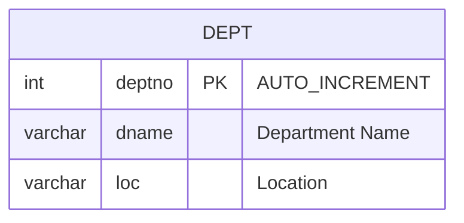
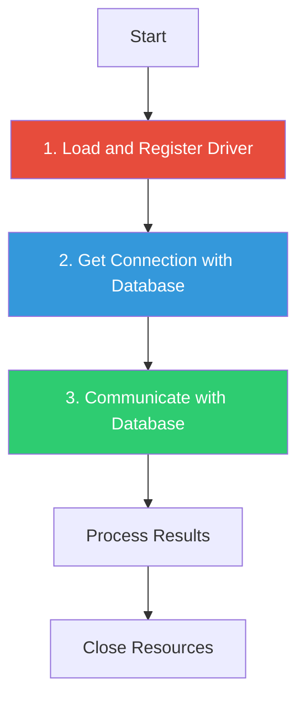
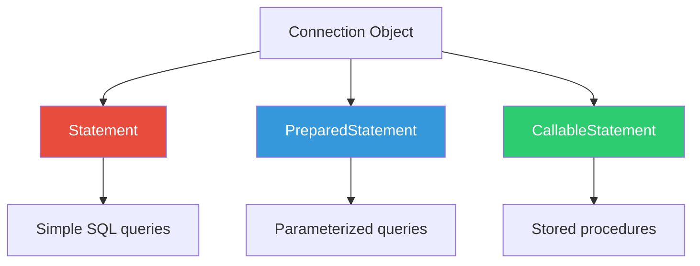
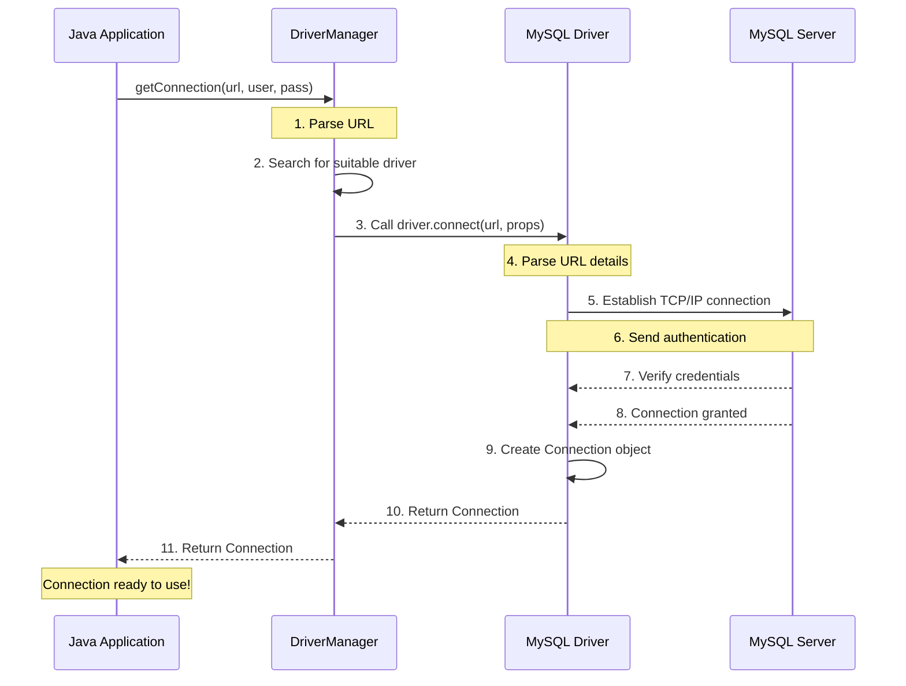
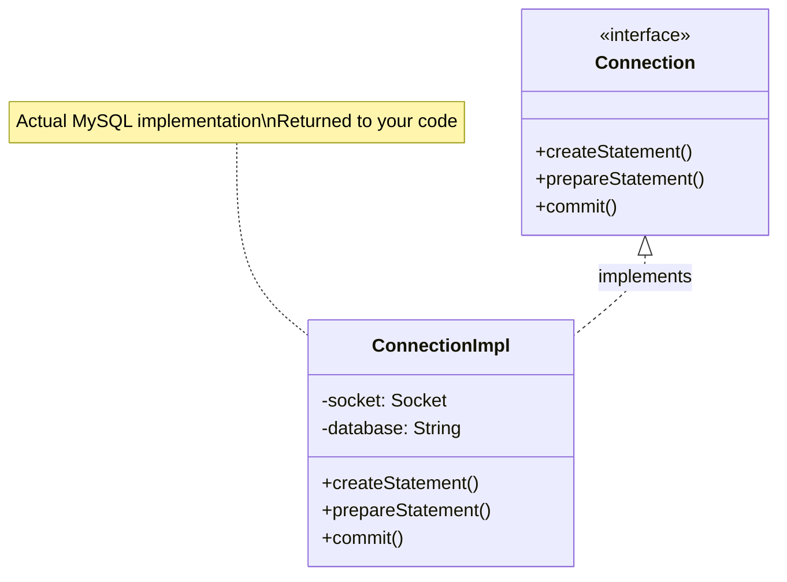
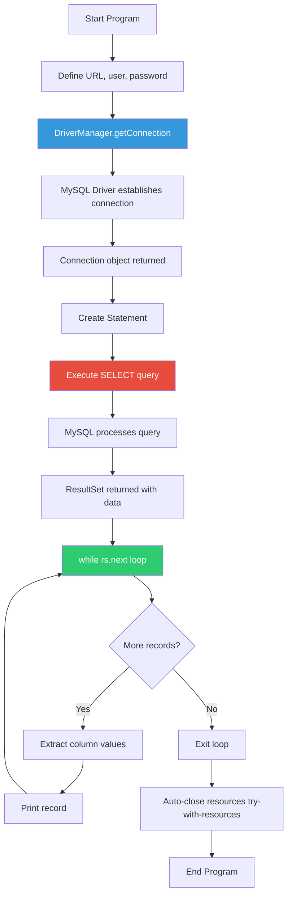

# 03 - Database Connection Basics

## Table of Contents
1. [Database URL Structure](#database-url-structure)
2. [Database Setup](#database-setup)
3. [Connection Establishment Process](#connection-establishment-process)
4. [getConnection() Internal Flow](#getconnection-internal-flow)
5. [Try-With-Resources (ARM)](#try-with-resources-arm)
6. [Complete Connection Example](#complete-connection-example)
7. [Key Takeaways](#key-takeaways)

---

## Database URL Structure

### The Connection String

Every JDBC connection requires a **Database URL** - a string that tells the driver:
- Which database system to connect to
- Where the database server is located
- Which specific database to use

### MySQL URL Format

```
jdbc:mysql://localhost:3306/mydb
```

Let's break this down component by component:

```mermaid
graph LR
    A[jdbc:mysql://localhost:3306/mydb] --> B[jdbc:]
    A --> C[mysql:]
    A --> D[//localhost]
    A --> E[:3306]
    A --> F[/mydb]
    
    B --> G[Main Protocol]
    C --> H[Sub-protocol]
    D --> I[Host]
    E --> J[Port]
    F --> K[Database]
    
    style A fill:#3498db,color:#fff
```

---

### Component Breakdown

#### 1. `jdbc:` - Main Protocol

| Component | Value | Meaning |
|-----------|-------|---------|
| **Protocol** | `jdbc` | Main protocol identifier |
| **Purpose** | Standard | Indicates this is a JDBC connection |
| **Fixed?** | YES | Always `jdbc` for JDBC connections |

**Explanation**: 
- `jdbc:` tells Java this is a JDBC database connection
- This prefix is **mandatory** and **constant** for all JDBC connections
- It's like `http:` for web URLs or `file:` for file paths

---

#### 2. `mysql:` - Sub-protocol

| Component | Value | Meaning |
|-----------|-------|---------|
| **Sub-protocol** | `mysql` | Database vendor identifier |
| **Purpose** | Routes to correct driver | Tells DriverManager which driver to use |
| **Fixed?** | NO | Changes based on database |

**Database-Specific Sub-protocols**:

| Database | Sub-protocol | Example URL |
|----------|--------------|-------------|
| MySQL | `mysql` | `jdbc:mysql://...` |
| Oracle | `oracle:thin` | `jdbc:oracle:thin:@...` |
| PostgreSQL | `postgresql` | `jdbc:postgresql://...` |
| SQL Server | `sqlserver` | `jdbc:sqlserver://...` |
| H2 | `h2` | `jdbc:h2://...` |

**How It Works**:
```java
// DriverManager looks at sub-protocol
String url = "jdbc:mysql://localhost:3306/mydb";
//              ^^^^^ DriverManager sees "mysql"
//                    and uses MySQL driver

String url = "jdbc:oracle:thin:@localhost:1521:xe";
//              ^^^^^^ DriverManager sees "oracle"
//                     and uses Oracle driver
```

---

#### 3. `//localhost` - Host/Machine

| Component | Value | Meaning |
|-----------|-------|---------|
| **Host** | `localhost` or IP | Machine where database server runs |
| **Purpose** | Network location | Tells driver where to connect |
| **Common Values** | `localhost`, `127.0.0.1`, `192.168.1.100` | Local or remote machine |

**Explanation**:
- `localhost` = Your own machine (127.0.0.1)
- IP address = Remote database server
- Hostname = Server name on network

**Examples**:

```java
// Local database on this machine
"jdbc:mysql://localhost:3306/mydb"

// Local database using IP
"jdbc:mysql://127.0.0.1:3306/mydb"

// Remote database server
"jdbc:mysql://192.168.1.50:3306/mydb"

// Remote server by hostname
"jdbc:mysql://db-server.company.com:3306/mydb"
```

---

#### 4. `:3306` - Port Number

| Component | Value | Meaning |
|-----------|-------|---------|
| **Port** | `3306` | Network port where database listens |
| **Purpose** | Connection endpoint | Specifies which service to connect to |
| **Database-Specific** | YES | Each DB has default port |

**Default Ports for Different Databases**:

| Database | Default Port | URL Example |
|----------|-------------|-------------|
| MySQL | 3306 | `jdbc:mysql://localhost:3306/mydb` |
| PostgreSQL | 5432 | `jdbc:postgresql://localhost:5432/mydb` |
| Oracle | 1521 | `jdbc:oracle:thin:@localhost:1521:xe` |
| SQL Server | 1433 | `jdbc:sqlserver://localhost:1433;database=mydb` |
| MongoDB | 27017 | N/A (NoSQL) |

**Why Port Numbers?**:
- A server can run **multiple services** on different ports
- Port number tells the network **which service** to connect to
- Like apartment numbers in a building - same address, different units

**Custom Ports**:
```java
// If MySQL runs on custom port 3307 instead of default 3306
"jdbc:mysql://localhost:3307/mydb"
```

---

#### 5. `/mydb` - Database Name

| Component | Value | Meaning |
|-----------|-------|---------|
| **Database** | `mydb` | Specific database to use |
| **Purpose** | Selects schema | Which database on the server |
| **Required?** | Usually YES | Most apps connect to specific DB |

**Explanation**:
- A database server can host **multiple databases**
- `/mydb` tells MySQL: "Use the `mydb` database"
- Like selecting a folder/directory on a file system

**Example Scenario**:
```sql
-- MySQL server has multiple databases:
mysql> SHOW DATABASES;
+--------------------+
| Database           |
+--------------------+
| mydb              |
| testdb            |
| productiondb      |
| employees_db      |
+--------------------+

-- Connection chooses one:
jdbc:mysql://localhost:3306/mydb          -- Uses mydb
jdbc:mysql://localhost:3306/productiondb -- Uses productiondb
```

---

### Complete URL Examples

#### Standard MySQL Connection
```java
String url = "jdbc:mysql://localhost:3306/mydb";
//            └─┬─┘ └──┬──┘  └────┬───┘ └┬┘ └┬┘
//              │      │          │      │   │
//           Protocol  │       Host   Port  Database
//                Sub-protocol
```

#### Oracle Connection
```java
String url = "jdbc:oracle:thin:@localhost:1521:xe";
//            jdbc: - Main protocol
//                 oracle:thin: - Sub-protocol (thin driver)
//                            @ - Oracle-specific syntax
//                             localhost:1521 - Host:Port
//                                          :xe - Database SID
```

#### PostgreSQL Connection
```java
String url = "jdbc:postgresql://localhost:5432/mydb";
//            jdbc: - Main protocol
//                 postgresql: - Sub-protocol
//                           //localhost:5432 - Host:Port
//                                           /mydb - Database
```

---

## Database Setup

### Creating the Database and Table

Before connecting, we need to create the database and tables in MySQL.

### Step-by-Step Database Creation

#### Step 1: Connect to MySQL

```bash
mysql -u root -p
# Enter password when prompted
```

#### Step 2: Create Database

```sql
mysql> create database Bit;
Query OK, 1 row affected (0.79 sec)
```

**Explanation**:
- `create database Bit;` - Creates a new database named "Bit"
- `Query OK, 1 row affected (0.79 sec)` - Success message with execution time

#### Step 3: Select/Use the Database

```sql
mysql> use Bit;
Database changed
```

**Explanation**:
- `use Bit;` - Switches to the Bit database
- All subsequent commands will execute in this database
- Like `cd` into a directory in command line

#### Step 4: Create Table

```sql
mysql> create table dept(
    deptno int(2) primary key auto_increment,
    dname varchar(20),
    loc varchar(30)
);
Query OK, 0 rows affected, 1 warning (1.55 sec)
```

**Table Structure Breakdown**:

| Column | Data Type | Constraints | Description |
|--------|-----------|-------------|-------------|
| `deptno` | `int(2)` | PRIMARY KEY, AUTO_INCREMENT | Department number (unique, auto-generated) |
| `dname` | `varchar(20)` | - | Department name (max 20 chars) |
| `loc` | `varchar(30)` | - | Location (max 30 chars) |

**Column Explanations**:

1. **`deptno int(2) primary key auto_increment`**:
   - `int(2)` - Integer with display width 2
   - `primary key` - Unique identifier, cannot be null, no duplicates
   - `auto_increment` - Automatically increments for each new row (1, 2, 3, ...)

2. **`dname varchar(20)`**:
   - `varchar` - Variable-length string
   - `(20)` - Maximum 20 characters
   - Can store department names like "Acc", "Training", etc.

3. **`loc varchar(30)`**:
   - Variable-length string
   - Maximum 30 characters
   - Stores location names

#### Step 5: Insert Sample Data

```sql
mysql> insert into dept(dname,loc) values('Acc','Mumbai');
Query OK, 1 row affected (0.25 sec)
```

**Note**: We don't specify `deptno` because it's `AUTO_INCREMENT` - MySQL generates it automatically!

```sql
mysql> insert into dept(dname,loc) values('Trg','Banglore');
Query OK, 1 row affected (0.18 sec)

mysql> insert into dept(dname,loc) values('Admin','Pune');
Query OK, 1 row affected (0.05 sec)
```

#### Step 6: Verify Data

```sql
mysql> select * from dept;
+--------+-------+----------+
| deptno | dname | loc      |
+--------+-------+----------+
|      1 | Acc   | Mumbai   |
|      2 | Trg   | Banglore |
|      3 | Admin | Pune     |
+--------+-------+----------+
3 rows in set (0.00 sec)
```

**Data Explanation**:
- `deptno` was automatically assigned: 1, 2, 3
- `dname` contains department names
- `loc` contains locations

---

### ER Diagram



---

## Connection Establishment Process

### Three Steps to JDBC Connection

Every JDBC application follows these **three fundamental steps**:



---

### Step 1: Load and Register the Driver

#### Old Way (Explicit Loading)

```java
// Load driver class into JVM memory
Class.forName("com.mysql.cj.jdbc.Driver");
```

**What this does**:
1. Loads the driver class
2. Executes static initializer block
3. Driver registers itself with DriverManager

#### Modern Way (Automatic - JDBC 4.0+)

```java
// No explicit loading needed!
// Just ensure mysql-connector-java-8.0.17.jar is in classpath
```

**What happens automatically**:
1. JVM scans classpath for JDBC drivers
2. Finds `META-INF/services/java.sql.Driver` in JAR
3. Loads and registers driver automatically

---

### Step 2: Get Connection with Database

```java
String url = "jdbc:mysql://localhost:3306/mydb";
Connection con = DriverManager.getConnection(url, "root", "root");
```

**Parameters Explained**:

| Parameter | Value | Purpose |
|-----------|-------|---------|
| `url` | `"jdbc:mysql://localhost:3306/mydb"` | Database connection string |
| `user` | `"root"` | Database username |
| `password` | `"root"` | Database password |

**Return Value**:
- Type: `Connection` (interface)
- Actual object: `com.mysql.cj.jdbc.ConnectionImpl` (implementation)

---

### Step 3: Communicate with Database

Three interfaces available for communication:



**Example**:
```java
// Create Statement
Statement st = con.createStatement();

// Execute query
ResultSet rs = st.executeQuery("SELECT * FROM dept");

// Process results
while(rs.next()) {
    System.out.println(rs.getInt("deptno"));
}
```

---

## getConnection() Internal Flow

### The Journey from Code to Connection

Let's understand **exactly** what happens when you call:
```java
Connection con = DriverManager.getConnection(url, "root", "root");
```

### Step-by-Step Internal Process



---

### Detailed Explanation

#### a) DriverManager.getConnection(url, user, password) is called

```java
String url = "jdbc:mysql://localhost:3306/mydb";
Connection con = DriverManager.getConnection(url, "root", "root");
```

**What the application does**:
- Calls static method `ge Connection()` on `DriverManager` class
- Passes database URL, username, and password

---

#### b) DriverManager searches for a suitable driver

**DriverManager's internal logic**:

```java
// Simplified DriverManager code
public static Connection getConnection(String url, String user, String password) {
    // Step 1: Get list of registered drivers
    for(Driver driver : registeredDrivers) {
        // Step 2: Check if this driver can handle the URL
        if(driver.acceptsURL(url)) {
            // Step 3: Try to connect
            Connection con = driver.connect(url, properties);
            if(con != null) {
                return con;
            }
        }
    }
    throw new SQLException("No suitable driver found");
}
```

**How driver selection works**:

1. **DriverManager maintains a list** of all registered drivers:
   ```java
   registeredDrivers = [
       com.mysql.cj.jdbc.Driver,
       oracle.jdbc.OracleDriver,
       org.postgresql.Driver,
       // ... other drivers
   ]
   ```

2. **For each driver**, calls `acceptsURL(url)`:
   ```java
   // MySQL Driver checks if URL starts with "jdbc:mysql:"
   mysqlDriver.acceptsURL("jdbc:mysql://...") → true ✓
   
   // Oracle Driver checks if URL starts with "jdbc:oracle:"
   oracleDriver.acceptsURL("jdbc:mysql://...") → false ✗
   ```

3. **First matching driver** is used to create connection

---

#### c) The appropriate driver handles the connection creation

**Condition**: 
```java
// provided the classpath for "com.mysql.cj.jdbc.Driver" is set
```

**What this means**:
- The driver JAR file must be in classpath
- Without JAR: `ClassNotFoundException` or `SQLException: No suitable driver`

**Driver's responsibilities**:
1. Check if it can handle the URL
2. If yes, create connection

---

#### d) The driver parses the URL and establishes a TCP/IP connection

**Driver parses URL**:

```java
// URL: jdbc:mysql://localhost:3306/mydb

Driver extracts:
- Protocol: mysql
- Host: localhost  
- Port: 3306
- Database: mydb
```

**Establishes TCP/IP connection**:

```java
// Driver creates socket connection
Socket socket = new Socket("localhost", 3306);

// Uses MySQL wire protocol to communicate
// Sends handshake packet to MySQL server
```

**Visual representation**:


---

#### e) Authentication is handled

**Driver sends authentication**:

```java
// Driver sends to MySQL server:
{
    "username": "root",
    "password": "root"  // Actually sent as hash
}
```

**MySQL server verifies**:
1. Checks if user "root" exists
2. Verifies password hash
3. Checks if user has permissions to access "mydb" database

**Possible outcomes**:

✅ **Success**: Credentials valid, access granted  
❌ **Failure**: `SQLException: Access denied for user 'root'@'localhost'`

---

#### f) A Connection object is created and returned

**Driver creates implementation class**:

```java
// MySQL Driver internally does:
ConnectionImpl actualConnection = new ConnectionImpl(socket, database, user);

// Returns as interface type:
return (Connection) actualConnection;
```

**What you receive**:

```java
Connection con = DriverManager.getConnection(...);

// Print the actual class:
System.out.println(con.getClass());
// Output: class com.mysql.cj.jdbc.ConnectionImpl
//              ^^^^^^^^^^^^^^^^^^^^^^^^^^^^^^^^^
//              This is MySQL's implementation
```

**Visual summary**:



---

### Why This Abstraction Matters

**Your code**:
```java
Connection con = DriverManager.getConnection(url, user, pass);
```

**What you get**:
- Interface reference: `Connection`
- Actual object: `ConnectionImpl` (MySQL-specific)

**Benefits**:
1. You code against `Connection` interface
2. Don't need to know about `ConnectionImpl`
3. Can switch databases without code changes
4. **Loose coupling achieved!**

---

## Try-With-Resources (ARM)

### What is Try-With-Resources?

**ARM** = **Automatic Resource Management** (introduced in Java 7)

**Purpose**: Automatically closes resources (Connection, Statement, ResultSet) when try block completes, whether normally or exceptionally.

### The Problem Before Java 7

```java
// OLD WAY - Manual resource management
Connection con = null;
Statement st = null;
ResultSet rs = null;

try {
    con = DriverManager.getConnection(url, "root", "root");
    st = con.createStatement();
    rs = st.executeQuery("SELECT * FROM dept");
    
    while(rs.next()) {
        System.out.println(rs.getInt("deptno"));
    }
} catch(Exception e) {
    e.printStackTrace();
} finally {
    // MUST close resources manually
    try { if(rs != null) rs.close(); } catch(Exception e) {}
    try { if(st != null) st.close(); } catch(Exception e) {}
    try { if(con != null) con.close(); } catch(Exception e) {}
}
```

**Problems**:
- ❌ **Verbose** - lots of boilerplate code
- ❌ **Error-prone** - easy to forget closing resources
- ❌ **Resource leaks** - if close() is forgotten

---

### The Solution: Try-With-Resources

```java
// NEW WAY - Automatic resource management
try(Connection con = DriverManager.getConnection(url, "root", "root");
    Statement st = con.createStatement();
    ResultSet rs = st.executeQuery("SELECT * FROM dept"))
{
    // Use resources
    while(rs.next()) {
        System.out.println(rs.getInt("deptno"));
    }
} // Resources automatically closed here!
catch(Exception e) {
    e.printStackTrace();
}
```

**Benefits**:
- ✅ **Automatic closing** - no finally block needed
- ✅ **Cleaner code** - less boilerplate
- ✅ **Exception safe** - resources closed even if exception occurs
- ✅ **Correct order** - resources closed in reverse order of creation

---

### How It Works

#### Requirements

Resources must implement `AutoCloseable` interface:

```java
public interface AutoCloseable {
    void close() throws Exception;
}
```

**JDBC classes that implement AutoCloseable**:
- ✅ `Connection`
- ✅ `Statement`
- ✅ `PreparedStatement`
- ✅ `CallableStatement`
- ✅ `ResultSet`

#### What Happens Behind the Scenes

```java
// Your code:
try(Connection con = DriverManager.getConnection(...)) {
    // use connection
}

// Compiler converts to:
Connection con = DriverManager.getConnection(...);
try {
    // use connection
} finally {
    if(con != null) {
        con.close();
    }
}
```

---

### Multiple Resources

```java
try(
    Connection con = DriverManager.getConnection(url, "root", "root");
    Statement st = con.createStatement();
    ResultSet rs = st.executeQuery("SELECT * FROM dept")
) {
    // Use all resources
}
// Closing happens in REVERSE order:
// 1. rs.close()
// 2. st.close()
// 3. con.close()
```

**Why reverse order matters**:
1. ResultSet depends on Statement
2. Statement depends on Connection
3. Close dependent resources first!

---

### Exception Handling

```java
try(Connection con = DriverManager.getConnection(url, "root", "root")) {
    Statement st = con.createStatement();
    ResultSet rs = st.executeQuery("SELECT * FROM dept");
    
    while(rs.next()) {
        System.out.println(rs.getInt("deptno"));
    }
}
catch(SQLException e) {
    // Handle exception
    System.out.println("Database error: " + e.getMessage());
}
catch(Exception e) {
    // Handle other exceptions
    System.out.println("Error: " + e.getMessage());
}
```

**What happens if exception occurs**:
1. Exception is thrown in try block
2. **Resources are closed automatically** (even with exception)
3. catch block handles the exception

---

## Complete Connection Example

### Full Working Example

```java
import java.sql.*;

public class ConnectionExample {
    public static void main(String[] args) {
        // Step 1: Define connection parameters
        String url = "jdbc:mysql://localhost:3306/mydb";
        String user = "root";
        String password = "root";
        
        // Step 2: Try-with-resources for automatic resource management
        try(Connection con = DriverManager.getConnection(url, user, password)) {
            
            // Verify connection
            System.out.println("Connection successful!");
            System.out.println("Implementation class: " + con.getClass());
            
            // Create statement
            Statement st = con.createStatement();
            
            // Execute query
            ResultSet rs = st.executeQuery("SELECT * FROM dept");
            
            // Process results
            System.out.println("\nDepartment Records:");
            System.out.println("-------------------");
            while(rs.next()) {
                int deptno = rs.getInt("deptno");
                String dname = rs.getString("dname");
                String loc = rs.getString("loc");
                
                System.out.println(deptno + "\t" + dname + "\t" + loc);
            }
            
        } catch(SQLException e) {
            System.out.println("Database error: " + e.getMessage());
            e.printStackTrace();
        }
    }
}
```

---

### Line-by-Line Explanation

#### Line 1: Import Statement
```java
import java.sql.*;
```
- **Purpose**: Import all JDBC classes and interfaces
- **Includes**: Connection, DriverManager, Statement, ResultSet, SQLException, etc.
- **Wildcard import**: `*` imports all classes from `java.sql` package

---

#### Lines 3-4: Class Declaration
```java
public class ConnectionExample {
    public static void main(String[] args) {
```
- **Class**: Standard Java class
- **main method**: Entry point of application
- **static**: Can be called without creating object
- **void**: Doesn't return anything
- **String[] args**: Command-line arguments array

---

#### Lines 5-7: Connection Parameters
```java
String url = "jdbc:mysql://localhost:3306/mydb";
String user = "root";
String password = "root";
```

**Line 5**: Database URL
- **Purpose**: Tells driver where and which database to connect to
- **Format**: `jdbc:mysql://host:port/database`
- **Value**: Connecting to MySQL on local machine, port 3306, database "mydb"

**Line 6**: Database username
- **Purpose**: Authenticate with database
- **Value**: "root" is MySQL's default admin user

**Line 7**: Database password
- **Purpose**: Password for authentication
- **Value**: "root" (should be changed for security in production!)

---

#### Line 9: Try-With-Resources
```java
try(Connection con = DriverManager.getConnection(url, user, password)) {
```

**What happens**:
1. **`DriverManager.getConnection(...)`**:
   - Calls static method on DriverManager
   - Searches for suitable driver (MySQL driver)
   - Driver creates TCP/IP connection to MySQL server
   - Sends username and password for authentication
   - Returns Connection object

2. **`Connection con =`**:
   - Stores the connection in variable `con`
   - Type: `Connection` (interface)
   - Actual object: `com.mysql.cj.jdbc.ConnectionImpl`

3. **`try(`**:
   - Try-with-resources statement
   - Connection will be **automatically closed** when try block ends

---

#### Lines 11-12: Connection Verification
```java
System.out.println("Connection successful!");
System.out.println("Implementation class: " + con.getClass());
```

**Line 11**: Print success message
- Only executes if connection succeeds
- If connection fails, jumps to catch block

**Line 12**: Print actual class
- **`con.getClass()`**: Returns the runtime class of the object
- **Output**: `class com.mysql.cj.jdbc.ConnectionImpl`
- **Shows**: MySQL's specific implementation of Connection interface

---

#### Line 14: Create Statement
```java
Statement st = con.createStatement();
```

**What this does**:
1. **`con.createStatement()`**: Method on Connection interface
2. **Returns**: Statement object (interface)
3. **Actual object**: `com.mysql.cj.jdbc.StatementImpl` (MySQL's implementation)
4. **Purpose**: Used to execute SQL queries

**Statement object capabilities**:
- Execute SELECT queries
- Execute INSERT/UPDATE/DELETE
- Execute any SQL statement

---

#### Line 16: Execute Query
```java
ResultSet rs = st.executeQuery("SELECT * FROM dept");
```

**What happens**:
1. **`st.executeQuery(...)`**: Method on Statement interface
2. **Parameter**: SQL SELECT query as String
3. **SQL**: `"SELECT * FROM dept"` - retrieve all records from dept table
4. **Returns**: ResultSet object containing query results
5. **Cursor position**: **Before** the first record

**Flow**:
```
Statement → SQL to MySQL → MySQL executes → Results returned → Stored in ResultSet
```

---

#### Lines 18-20: Display Header
```java
System.out.println("\nDepartment Records:");
System.out.println("-------------------");
```
- **`\n`**: New line character
- Prints header for output formatting

---

#### Line 21: Loop Through Results
```java
while(rs.next()) {
```

**What `rs.next()` does**:
1. **Moves cursor** to next record
2. **Returns `true`** if record exists
3. **Returns `false`** if no more records (end of data)
4. **First call**: Moves from "before first record" to "first record"

**Visual representation**:
```
Initial position:
[CURSOR] → Record 1, Record 2, Record 3

After first rs.next():
Record 1 [CURSOR] → Record 2, Record 3

After second rs.next():
Record 1, Record 2 [CURSOR] → Record 3

After third rs.next():
Record 1, Record 2, Record 3 [CURSOR] → (no more records)

After fourth rs.next():
Returns false, loop exits
```

---

#### Lines 22-24: Extract Column Values
```java
int deptno = rs.getInt("deptno");
String dname = rs.getString("dname");
String loc = rs.getString("loc");
```

**Line 22**: Get integer value
- **`rs.getInt("deptno")`**: Extract value from "deptno" column
- **Parameter**: Column name as String
- **Returns**: int value
- **Example**: If deptno is 1, returns int 1

**Line 23**: Get string value
- **`rs.getString("dname")`**: Extract value from "dname" column
- **Returns**: String value
- **Example**: If dname is "Acc", returns String "Acc"

**Line 24**: Get location
- **`rs.getString("loc")`**: Extract value from "loc" column
- **Returns**: String value

**Alternative syntax**:
```java
// By column index (1-based)
int deptno = rs.getInt(1);      // First column
String dname = rs.getString(2);  // Second column
String loc = rs.getString(3);    // Third column
```

---

#### Line 26: Print Record
```java
System.out.println(deptno + "\t" + dname + "\t" + loc);
```
- **`deptno + "\t" + ...`**: Concatenate values with tab separator
- **`\t`**: Tab character for alignment
- **Output**: `1    Acc    Mumbai`

---

#### Line 29: Catch Block
```java
} catch(SQLException e) {
```
- **Catches**: SQLException (database-related errors)
- **Examples**: Connection failed, invalid SQL, table doesn't exist
- **Parameter**: `e` is the exception object

---

#### Lines 30-31: Error Handling
```java
System.out.println("Database error: " + e.getMessage());
e.printStackTrace();
```

**Line 30**: Print error message
- **`e.getMessage()`**: Returns short error description
- **Example**: "Access denied for user 'root'@'localhost'"

**Line 31**: Print full stack trace
- Shows complete error details
- Shows where error occurred
- Useful for debugging

---

### Expected Output

```
Connection successful!
Implementation class: class com.mysql.cj.jdbc.ConnectionImpl

Department Records:
-------------------
1       Acc     Mumbai
2       Trg     Banglore
3       Admin   Pune
```

---

### Complete Data Flow



---

## Key Takeaways

### Database URL Structure
```
jdbc:mysql://localhost:3306/mydb
│    │       │         │    │
│    │       │         │    └─ Database name
│    │       │         └────── Port number
│    │       └──────────────── Host/machine
│    └──────────────────────── Sub-protocol (DB vendor)
└───────────────────────────── Main protocol
```

### Connection Steps
1. **Load driver** (automatic in JDBC 4.0+)
2. **Get connection** using `DriverManager.getConnection()`
3. **Create statement** for SQL execution
4. **Process results** from queries

### getConnection() Internal Flow
1. DriverManager searches for suitable driver
2. Driver parses URL
3. Driver establishes TCP/IP connection
4. Authentication sent to database
5. Connection object created and returned

### Try-With-Resources Benefits
- ✅ Automatic resource closing
- ✅ Exception-safe
- ✅ Less boilerplate code
- ✅ Resources implement `AutoCloseable`

### Best Practices
1. **Always use try-with-resources** for JDBC connections
2. **Never hardcode credentials** - use configuration files
3. **Close resources** in correct order (reverse of creation)
4. **Handle SQLExceptions** properly
5. **Use connection pooling** in production (not creating new connection each time)

---

**Next**: [04 - Statement Interface Basics](./04_Statement_Interface_Basics.md)

Now that we can connect to a database, let's learn how to execute SQL queries using the Statement interface!
