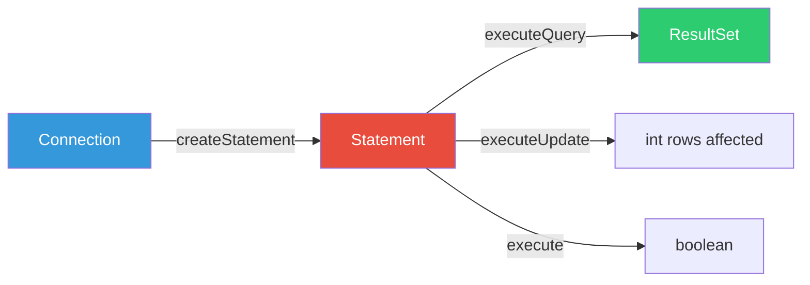
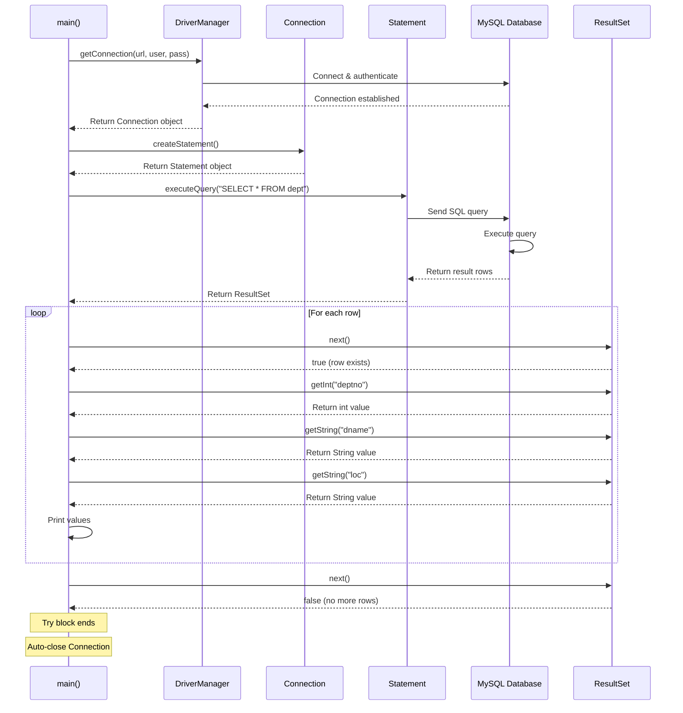
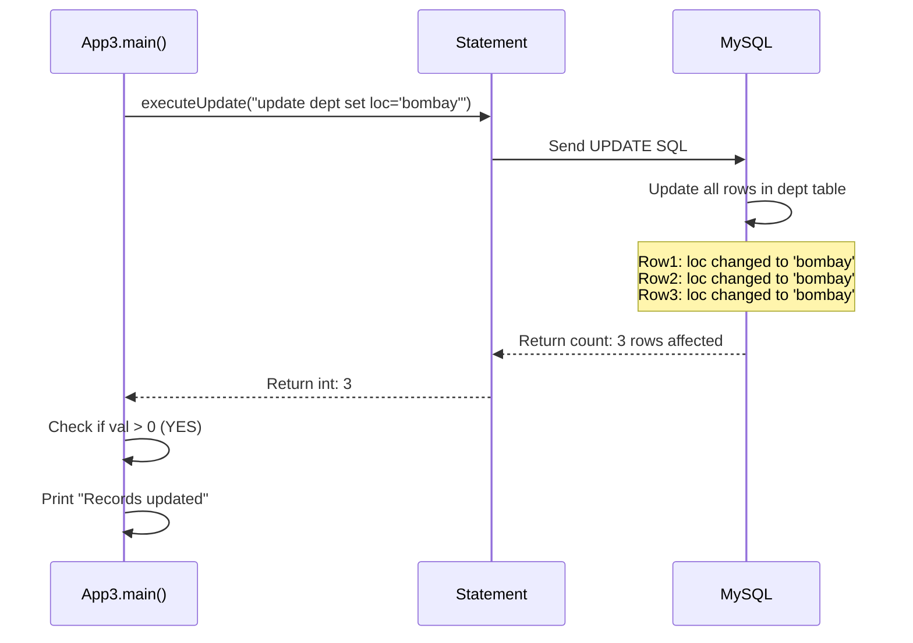
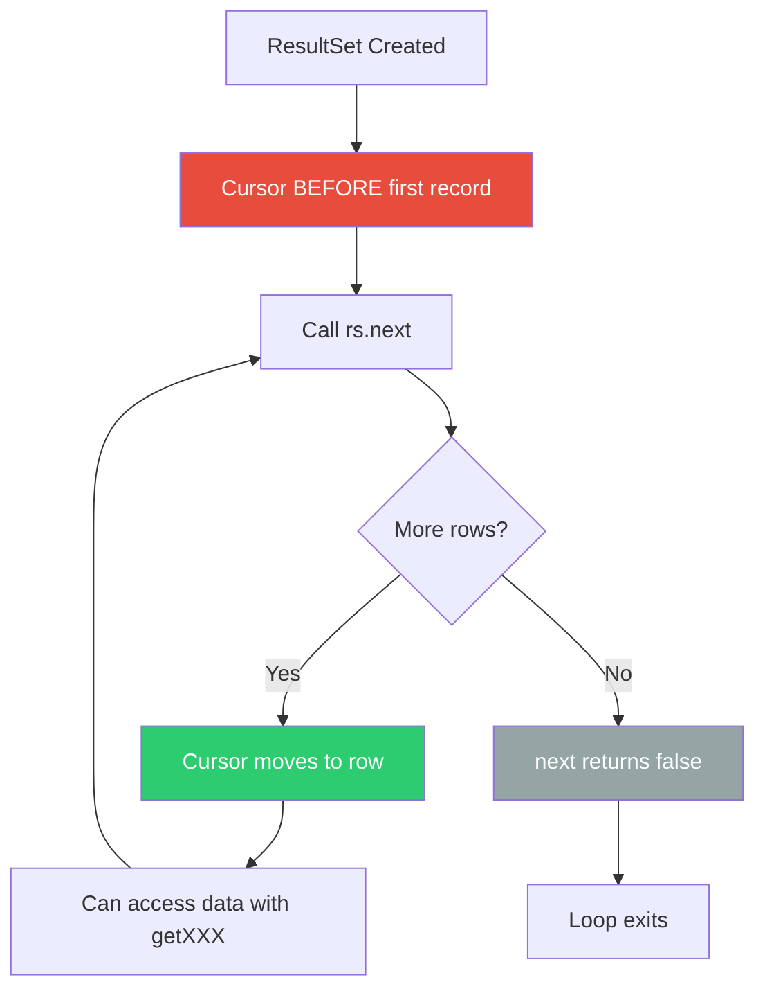

# 04 - Statement Interface Basics

## Table of Contents
1. [Statement Interface Overview](#statement-interface-overview)
2. [Creating Statement Objects](#creating-statement-objects)
3. [executeQuery() for SELECT](#executequery-for-select)
4. [executeUpdate() for DML](#executeupdate-for-dml)
5. [App1: Basic SELECT Example](#app1-basic-select-example)
6. [App3: UPDATE Example](#app3-update-example)
7. [ResultSet Navigation](#resultset-navigation)
8. [Auto-Commit Concept](#auto-commit-concept)
9. [Key Takeaways](#key-takeaways)

---

## Statement Interface Overview

### What is Statement?

**Statement** is an interface in `java.sql` package used to **execute SQL queries** and **send them to the database**.



### Three Ways to Communicate with Database

Once connected, you can communicate using these interfaces:

| Interface | Purpose | Use Case |
|-----------|---------|----------|
| **Statement** | Simple SQL queries | Static SQL without parameters |
| **PreparedStatement** | Parameterized queries | Dynamic SQL with placeholders |
| **CallableStatement** | Stored procedures | Call database procedures/functions |

---

## Creating Statement Objects

### Syntax

```java
Connection con = DriverManager.getConnection(url, user, password);
Statement st = con.createStatement();
```

### Method Details

- **Method**: `createStatement()`
- **On**: Connection interface
- **Returns**: Statement object
- **Actual class**: Database-specific implementation (e.g., `com.mysql.cj.jdbc.StatementImpl`)

### Example

```java
try(Connection con = DriverManager.getConnection(ss, "root", "root")) {
    // Create Statement from Connection
    Statement st = con.createStatement();
    
    // Now ready to execute SQL
}
```

---

## executeQuery() for SELECT

### Purpose

Used to execute **SELECT queries** that return data.

### Method Signature

```java
ResultSet executeQuery(String sql) throws SQLException
```

### Characteristics

| Aspect | Details |
|--------|---------|
| **Parameter** | SQL SELECT query as String |
| **Returns** | ResultSet containing query results |
| **Use for** | SELECT statements only |
| **Throws** | SQLException if query fails |

### Example

```java
Statement st = con.createStatement();
ResultSet rs = st.executeQuery("SELECT * FROM dept");

while(rs.next()) {
    // Process each row
    int deptno = rs.getInt("deptno");
    String dname = rs.getString("dname");
}
```

---

## executeUpdate() for DML

### Purpose

Used for **INSERT, UPDATE, DELETE** operations (Data Manipulation Language).

### Method Signature

```java
int executeUpdate(String sql) throws SQLException
```

### Characteristics

| Aspect | Details |
|--------|---------|
| **Parameter** | SQL DML query as String |
| **Returns** | int - number of rows affected |
| **Use for** | INSERT, UPDATE, DELETE, DDL |
| **Throws** | SQLException if query fails |

### Return Value Interpretation

```java
int rowsAffected = st.executeUpdate("UPDATE dept SET loc='Mumbai'");

if(rowsAffected > 0) {
    System.out.println(rowsAffected + " rows updated successfully");
} else {
    System.out.println("No rows updated");
}
```

**Possible values**:
- `0` - No rows affected (e.g., no matching records)
- `> 0` - Number of rows successfully modified
- `-1` - Operation doesn't affect rows (some DDL statements)

---

## App1: Basic SELECT Example

### Complete Code

```java
import java.sql.*;

public class App1 {
    public static void main(String args[]) {
        String ss = "jdbc:mysql://localhost:3306/mydb";
        try(Connection con = DriverManager.getConnection(ss, "root", "root")) {
            System.out.println("Implementation class is\t" + con.getClass()); 
            Statement st = con.createStatement();
            ResultSet rs = st.executeQuery("select * from dept");
            
            while(rs.next()) {
                int no = rs.getInt("deptno");
                String name = rs.getString("dname");
                String add = rs.getString("loc");
                System.out.println(no + "\t" + name + "\t" + add);
            }
        }
        catch(Exception ee) {
            System.out.println(ee);
        }
    }
}
```

---

### Line-by-Line Explanation

#### Line 1: Import Statement
```java
import java.sql.*;
```
**Explanation**:
- Imports all classes and interfaces from `java.sql` package
- Includes: `Connection`, `DriverManager`, `Statement`, `ResultSet`, `SQLException`
- Wildcard `*` imports all public classes/interfaces

---

#### Lines 2-4: Class and Method Declaration
```java
public class App1 {
    public static void main(String args[]) {
```
**Explanation**:
- `public class App1` - Defines public class named App1
- `public static void main(String args[])` - Entry point of application
  - `static` - Can be called without creating App1 object
  - `void` - Doesn't return any value
  - `String args[]` - Command-line arguments array

---

#### Line 5: Connection URL
```java
String ss = "jdbc:mysql://localhost:3306/mydb";
```
**Explanation**:
- Stores database connection URL in variable `ss`
- `jdbc` - Protocol
- `mysql` - Sub-protocol (MySQL database)
- `localhost` - Database server location (this machine)
- `3306` - MySQL default port
- `mydb` - Database name to connect to

**Why variable name `ss`?**
- Short for "String for SQL" or "connection String"
- Could be any valid variable name (url, connectionUrl, etc.)

---

#### Line 6: Try-With-Resources
```java
try(Connection con = DriverManager.getConnection(ss, "root", "root")) {
```
**Explanation**:
- `try(...)` - Try-with-resources statement for automatic cleanup
- `DriverManager.getConnection(ss, "root", "root")` - Gets database connection
  - Parameter 1: `ss` - connection URL
  - Parameter 2: `"root"` - database username
  - Parameter 3: `"root"` - database password
- `Connection con =` - Stores connection in variable `con`

**What happens internally**:
1. DriverManager finds MySQL driver
2. Driver connects to localhost:3306
3. Sends username/password for authentication
4. Returns Connection object
5. Connection auto-closes when try block ends

---

#### Line 7: Print Connection Class
```java
System.out.println("Implementation class is\t" + con.getClass());
```
**Explanation**:
- Prints the actual implementation class of Connection
- `con.getClass()` - Returns the runtime class
- `\t` - Tab character for formatting
- **Sample output**: `Implementation class is    class com.mysql.cj.jdbc.ConnectionImpl`

**Why print this?**
- Demonstrates that `con` is an interface reference
- Points to MySQL-specific implementation class
- Shows loose coupling in action

---

#### Line 8: Create Statement
```java
Statement st = con.createStatement();
```
**Explanation**:
- `con.createStatement()` - Method on Connection interface
- Creates a Statement object for executing SQL
- Returns: Statement implementation (e.g., `StatementImpl`)
- Stored in variable `st`

**Purpose**: Statement is the courier that carries SQL to database

---

#### Line 9: Execute Query
```java
ResultSet rs = st.executeQuery("select * from dept");
```
**Explanation**:
- `st.executeQuery(...)` - Executes SELECT query
- Parameter: `"select * from dept"` - SQL query as String
  - `select *` - Select all columns
  - `from dept` - From dept table
- Returns: ResultSet containing all rows from dept table
- Stored in variable `rs`

**What happens**:
1. SQL sent to MySQL server
2. MySQL executes query
3. Results packaged into ResultSet
4. ResultSet cursor positioned **before** first row

**Visual**:
```
[CURSOR] → Row1, Row2, Row3
```

---

#### Line 10: Loop Declaration
```java
while(rs.next()) {
```
**Explanation**:
- `while` loop - Repeats as long as condition is true
- `rs.next()` - Advances cursor to next row
  - Returns `true` if row exists
  - Returns `false` if no more rows
- First call: Moves cursor to first row
- Each iteration: Moves to next row
- When no more rows: Returns false, exits loop

**Visual flow**:
```
Iteration 1: [CURSOR moves] Row1 → Row2, Row3  (next() returns true)
Iteration 2: Row1 → [CURSOR moves] Row2 → Row3 (next() returns true)
Iteration 3: Row1, Row2 → [CURSOR moves] Row3  (next() returns true)
Iteration 4: Row1, Row2, Row3 → [CURSOR end]   (next() returns false, loop exits)
```

---

#### Lines 11-13: Extract Column Values
```java
int no = rs.getInt("deptno");
String name = rs.getString("dname");
String add = rs.getString("loc");
```

**Line 11**: Get integer column
- `rs.getInt("deptno")` - Extracts value from "deptno" column
- **Parameter**: Column name as String
- **Returns**: int value
- Stored in variable `no`

**Example**: If current row has deptno=1, `no` becomes 1

**Line 12**: Get string column
- `rs.getString("dname")` - Extracts value from "dname" column
- **Returns**: String value
- Stored in variable `name`

**Example**: If dname="Acc", `name` becomes "Acc"

**Line 13**: Get location column
- `rs.getString("loc")` - Extracts value from "loc" column
- **Returns**: String value
- Stored in variable `add`

**Alternative syntax** (column index, 1-based):
```java
int no = rs.getInt(1);      // First column
String name = rs.getString(2);  // Second column
String add = rs.getString(3);   // Third column
```

---

#### Line 14: Print Record
```java
System.out.println(no + "\t" + name + "\t" + add);
```
**Explanation**:
- Concatenates and prints values from current row
- `+` - String concatenation operator
- `"\t"` - Tab character for alignment
- Prints: `1    Acc    Mumbai`

---

#### Lines 15-19: Exception Handling
```java
        }
    }
    catch(Exception ee) {
        System.out.println(ee);
    }
}
```

**Line 16**: Closing braces
- Closes `while` loop
- Closes `try` block (Connection auto-closes here due to try-with-resources!)

**Lines 17-19**: Catch block
- `catch(Exception ee)` - Catches any exception
- `ee` - Exception object
- `System.out.println(ee)` - Prints exception details

**Why catch Exception (broad)?**
- Catches SQLException (database errors)
- Catches any other runtime exceptions
- Not best practice (should catch SQLException specifically), but simple for demos

---

### Execution Flow Diagram



---

### Sample Output

```
Implementation class is    class com.mysql.cj.jdbc.ConnectionImpl
1       Acc     Mumbai
2       Trg     Banglore
3       Admin   Pune
```

---

### Key Points from App1

1. **No explicit driver loading** needed (JDBC 4.0+)
2. **Try-with-resources** automatically closes Connection
3. **Statement.executeQuery()** returns ResultSet for SELECT
4. **ResultSet.next()** must be called before accessing data
5. **Column access** by name or index (1-based)

---

## App3: UPDATE Example

### Complete Code

```java
import java.sql.*;

public class App3 {
    public static void main(String args[]) {
        String ss = "jdbc:mysql://localhost:3306/mydb";
        try(Connection con = DriverManager.getConnection(ss, "root", "root")) {
            System.out.println("Implementation class is\t" + con.getClass());
            Statement st = con.createStatement();
            int val = st.executeUpdate("update dept set loc='bombay'");
            
            if(val > 0) {
                System.out.println("Records updated");
            }
            else {
                System.out.println("can not update records");
            }   
        }
        catch(Exception ee) {
            System.out.println(ee);
        }
    }
}
```

---

### Line-by-Line Explanation

Lines 1-8 are identical to App1, so we'll focus on the differences:

#### Line 9: Execute UPDATE
```java
int val = st.executeUpdate("update dept set loc='bombay'");
```

**Explanation**:
- `st.executeUpdate(...)` - Executes UPDATE query (not SELECT)
- Parameter: `"update dept set loc='bombay'"` - SQL UPDATE statement
  - `update dept` - Table to update
  - `set loc='bombay'` - Set loc column to 'bombay'
  - **No WHERE clause** - Updates ALL rows!
- Returns: `int` representing number of rows affected
- Stored in variable `val`

**What happens**:
1. SQL sent to database
2. Database updates all matching rows
3. Returns count of updated rows
4. If 3 rows updated, `val` = 3

**Important**: This updates ALL rows because no WHERE clause!

Better query with WHERE:
```java
int val = st.executeUpdate("update dept set loc='bombay' where deptno=1");
```

---

#### Lines 11-16: Check Result
```java
if(val > 0) {
    System.out.println("Records updated");
}
else {
    System.out.println("can not update records");
}
```

**Explanation**:
- `if(val > 0)` - Checks if any rows were updated
  - `val > 0` means at least one row updated
  - `val == 0` means no rows affected (e.g., no matching records)
- **True branch**: Prints success message
- **False branch**: Prints failure message

**Possible scenarios**:

| Scenario | val value | Output |
|----------|-----------|--------|
| 3 rows updated | 3 | "Records updated" |
| No matching rows | 0 | "can not update records" |
| Table is empty | 0 | "can not update records" |

---

### Execution Flow



---

### Key Differences: App1 vs App3

| Aspect | App1 (SELECT) | App3 (UPDATE) |
|--------|---------------|---------------|
| **Method** | `executeQuery()` | `executeUpdate()` |
| **SQL Type** | SELECT | UPDATE |
| **Returns** | ResultSet | int (rows affected) |
| **Purpose** | Retrieve data | Modify data |
| **Processing** | Loop through ResultSet | Check row count |

---

## ResultSet Navigation

### cursor in ResultSet

The **cursor** is an internal pointer that indicates the current position in the ResultSet.



### Initial Position

> **Inside ResultSet record pointer is always BEFORE the first record**

**Visual**:
```
Position:  [CURSOR] | Record1 | Record2 | Record3 |
```

- Cannot access data without calling `next()`
- Must call `next()` to position cursor on first record

---

### rs.next() Method

**Purpose**: Advances cursor to next row

**Returns**:
- `true` - Successfully moved to next row, data available
- `false` - No more rows, end of ResultSet

**Example**:
```java
ResultSet rs = st.executeQuery("SELECT * FROM dept");

// Initial: [CURSOR] Record1 Record2 Record3

rs.next(); // Returns true, cursor now at Record1
rs.next(); // Returns true, cursor now at Record2
rs.next(); // Returns true, cursor now at Record3
rs.next(); // Returns false, no more records
```

---

### getXXX() Methods

Used to extract data from current row.

| Method | Return Type | Use For | Example |
|--------|-------------|---------|---------|
| `getInt(String col)` | int | Integer columns | `rs.getInt("deptno")` |
| `getString(String col)` | String | String columns | `rs.getString("dname")` |
| `getDouble(String col)` | double | Decimal columns | `rs.getDouble("salary")` |
| `getDate(String col)` | java.sql.Date | Date columns | `rs.getDate("hiredate")` |
| `getBoolean(String col)` | boolean | Boolean columns | `rs.getBoolean("active")` |
| `getObject(String col)` | Object | Any column | `rs.getObject("dname")` |

**Column access two ways**:
```java
// By column name (preferred - more readable)
String name = rs.getString("dname");

// By column index (1-based, not 0-based!)
String name = rs.getString(2);  // 2nd column
```

---

### Common Pattern

```java
ResultSet rs = st.executeQuery("SELECT * FROM dept");

while(rs.next()) {  // Move to next row
    // Extract data from current row
    int deptno = rs.getInt("deptno");
    String dname = rs.getString("dname");
    String loc = rs.getString("loc");
    
    // Process data
    System.out.println(deptno + " " + dname + " " + loc);
}
```

**Flow**:
1. `next()` moves to first row → returns true
2. Extract data from current row
3. Process/print data
4. Loop back to while condition
5. `next()` moves to second row → returns true
6. ... repeat until no more rows
7. `next()` returns false → loop exits

---

## Auto-Commit Concept

### What is Auto-Commit?

> **By default auto commit is 'ON' in JDBC**

**Definition**: Auto-commit means every SQL statement is **automatically committed** to the database immediately after execution.

---

### Auto-Commit ON (Default)

```java
Connection con = DriverManager.getConnection(url, user, pass);
// Auto-commit is ON by default

Statement st = con.createStatement();
st.executeUpdate("UPDATE dept SET loc='Mumbai'");
// Changes immediately saved to database - auto-committed!

// If you check database now, changes are permanent
```

**Behavior**:
- Each `executeUpdate()` is a separate transaction
- Changes are **permanent** immediately
- Cannot rollback after execution

---

### Auto-Commit OFF (Manual Transaction)

```java
Connection con = DriverManager.getConnection(url, user, pass);

// Disable auto-commit
con.setAutoCommit(false);

try {
    Statement st = con.createStatement();
    st.executeUpdate("UPDATE dept SET loc='Mumbai'");
    st.executeUpdate("UPDATE emp SET salary=50000");
    
    // Both queries executed but not committed yet
    // Changes visible only in this connection
    
    // Manually commit
    con.commit();  // Now changes are permanent
    
} catch(SQLException e) {
    // If error, rollback all changes
    con.rollback();
}

// Re-enable auto-commit
con.setAutoCommit(true);
```

**Behavior**:
- Multiple statements in single transaction
- Changes **not permanent** until `commit()`
- Can `rollback()` if error occurs
- All-or-nothing  execution

---

### Auto-Commit Comparison

| Aspect | Auto-Commit ON | Auto-Commit OFF |
|--------|----------------|-----------------|
| **Default** | YES | NO |
| **Commit** | Automatic after each SQL | Manual with `commit()` |
| **Rollback** | Not possible | Possible with `rollback()` |
| **Use Case** | Simple operations | Complex transactions |
| **Safety** | Each SQL is atomic | Group of SQLs are atomic |

---

### App3 and Auto-Commit

In App3:
```java
Statement st = con.createStatement();
int val = st.executeUpdate("update dept set loc='bombay'");
```

**What happens**:
1. UPDATE executed
2. **Auto-committed immediately** (default behavior)
3. Changes are permanent in database
4. No need to call `con.commit()`

If you query the database in another tool/application, you'll see the updated values!

---

## Key Takeaways

### Statement Interface
- Created from Connection: `con.createStatement()`
- Used for static SQL queries (no parameters)
- Three execution methods:
  - `executeQuery()` - SELECT, returns ResultSet
  - `executeUpdate()` - INSERT/UPDATE/DELETE, returns int
  - `execute()` - Any SQL, returns boolean

### ResultSet Navigation
- Cursor starts **before** first record
- `rs.next()` moves cursor and returns true/false
- `getXXX()` methods extract column data
- Access by column name (readable) or index (1-based)

### Auto-Commit
- **Default: ON** - each SQL auto-commits
- Changes are immediate and permanent
- Can be disabled for transactions
- App3 uses default auto-commit

### Best Practices
1. Use try-with-resources for automatic cleanup
2. Access columns by name for readability
3. Check return values (row counts from UPDATE)
4. Handle SQLException appropriately
5. Use PreparedStatement for user input (next topic!)

---

**Next**: [05 - ResultSetMetaData](./05_ResultSetMetaData.md)

What if you don't know the table structure? Let's learn how to dynamically discover it!
