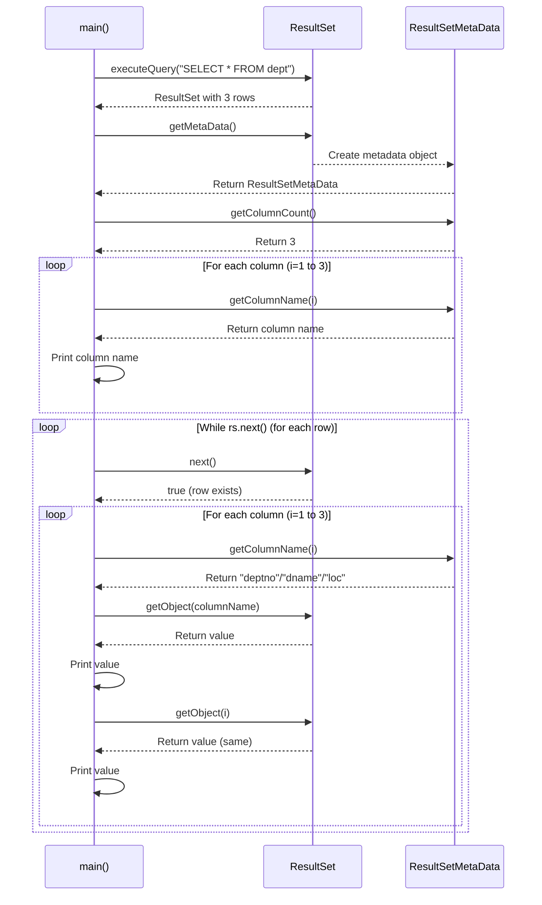

# 05 - ResultSetMetaData

## Table of Contents
1. [The Problem](#the-problem)
2. [ResultSetMetaData Solution](#resultsetmetadata-solution)
3. [Key Methods](#key-methods)
4. [App2: Dynamic Query Processing](#app2-dynamic-query-processing)
5. [rs.getObject() Method](#rsgetobject-method)
6. [Key Takeaways](#key-takeaways)

---

## The Problem

### Programmer's Dilemma

Consider this code from App1:
```java
ResultSet rs = st.executeQuery("select * from dept");
while(rs.next()) {
    int no = rs.getInt("deptno");       // Knows column exists
    String name = rs.getString("dname"); // Knows column name
    String add = rs.getString("loc");    // Knows column type
    System.out.println(no + "\t" + name + "\t" + add);
}
```

**This code assumes programmer knows 3 things**:
1. **How many columns** are there → 3 columns
2. **What are their names** → deptno, dname, loc
3. **What are their types** → int, varchar, varchar

> **Question**: What if programmer does NOT know any ofthese? Will he be able to display records?

**Answer**: YES! With the help of **ResultSetMetaData** interface!

---

## ResultSetMetaData Solution

### What is ResultSetMetaData?

> **ResultSetMetaData** gives complete information about ResultSet such as number of columns, their names, types, etc.

**Definition**: ResultSetMetaData is an interface that provides metadata (data about data) about the ResultSet.

### How to Get ResultSetMetaData

```java
ResultSet rs = st.executeQuery("SELECT * FROM dept");

// Get metadata from ResultSet
ResultSetMetaData rms = rs.getMetaData();
```

**Method**: `getMetaData()` on ResultSet  
**Returns**: ResultSetMetaData object

---

## Key Methods

### Essential ResultSetMetaData Methods

| Method | Return Type | Purpose | Example |
|--------|-------------|---------|---------|
| `getColumnCount()` | int | Number of columns in ResultSet | `rms.getColumnCount()` → 3 |
| `getColumnName(int column)` | String | Name of specified column (1-based) | `rms.getColumnName(1)` → "deptno" |
| `getColumnType(int column)` | int | SQL type of column | `rms.getColumnType(1)` → 4 (INTEGER) |
| `getColumnTypeName(int column)` | String | Database-specific type name | `rms.getColumnTypeName(1)` → "INT" |
| `getTableName(int column)` | String | Table name of column | `rms.getTableName(1)` → "dept" |
| `isNullable(int column)` | int | Whether column can be NULL | `rms.isNullable(1)` → 0 (NO_NULLS) |

### Column Indexing

**Important**: Column indices in ResultSetMetaData are **1-based** (not 0-based)!

```java
rms.getColumnName(1)  // First column
rms.getColumnName(2)  // Second column
rms.getColumnName(3)  // Third column
```

---

## App2: Dynamic Query Processing

### Complete Code

```java
import java.sql.*;

public class App2 {
    public static void main(String args[]) {
        String ss = "jdbc:mysql://localhost:3306/mydb";
        try(Connection con = DriverManager.getConnection(ss, "root", "root")) {
            System.out.println("Implementation class is\t" + con.getClass()); 
            Statement st = con.createStatement();
            ResultSet rs = st.executeQuery("select * from dept");
            
            ResultSetMetaData rms = rs.getMetaData();
            int col = rms.getColumnCount();
            
            System.out.println("Details of Dept by explicitly registering");
            
            // Print column headers dynamically
            for(int i = 1; i <= col; i++) {
                System.out.print(rms.getColumnName(i) + "\t");
            }
            
            // Print rows dynamically
            while(rs.next()) {
                System.out.print("\n");
                for(int i = 1; i <= col; i++) {
                    System.out.print(rs.getObject(rms.getColumnName(i)) + "\t");
                    System.out.print(rs.getObject(i) + "\t");
                }
            }
        }
        catch(Exception ee) {
            System.out.println(ee);
        }
    }
}
```

---

### Line-by-Line Explanation

Lines 1-9 are similar to App1. Focusing on the new concepts:

#### Lines 11-12: Get Metadata
```java
ResultSetMetaData rms = rs.getMetaData();
int col = rms.getColumnCount();
```

**Line 11**: Get metadata object
- `rs.getMetaData()` - Method on ResultSet interface
- Returns ResultSetMetaData object
- Contains information about ResultSet structure
- Stored in variable `rms`

**Line 12**: Get column count
- `rms.getColumnCount()` - Returns total number of columns
- For dept table: returns 3 (deptno, dname, loc)
- Stored in variable `col`
- **Use**: Now we know how many columns without hardcoding!

---

#### Line 14: Print Header
```java
System.out.println("Details of Dept by explicitly registering");
```
- Prints message to indicate dynamic processing
- "explicitly registering" refers to using metadata to discover structure

---

#### Lines 16-18: Dynamic Column Headers
```java
for(int i = 1; i <= col; i++) {
    System.out.print(rms.getColumnName(i) + "\t");
}
```

**Explanation**:
- `for` loop from 1 to `col` (column count)
- **i = 1**: Column indices are 1-based!
- `rms.getColumnName(i)` - Gets name of i-th column
  - When i=1: returns "deptno"
  - When i=2: returns "dname"
  - When i=3: returns "loc"
- `System.out.print(...)` - Prints without newline
- `"\t"` - Tab separator

**Output**: `deptno    dname    loc    `

**Key Advantage**: Works for any table! Change query to "select * from emp" and headers adjust automatically!

---

#### Line 20: Loop Through Rows
```java
while(rs.next()) {
```
- Same as before: loops through each row in ResultSet
- `rs.next()` moves cursor to next row
- Returns true if row exists, false otherwise

---

#### Line 21: New Line
```java
System.out.print("\n");
```
- Prints new line character
- Moves to next line for each row
- Without this, all data would be on one line

---

#### Lines 22-26: Dynamic Data Extraction
```java
for(int i = 1; i <= col; i++) {
    System.out.print(rs.getObject(rms.getColumnName(i)) + "\t");
    System.out.print(rs.getObject(i) + "\t");
}
```

**Line 22**: Loop through columns
- For each column in current row
- `i = 1 to col` - visits every column

**Line 23**: Get value by column name
- `rms.getColumnName(i)` - Gets column name (e.g., "deptno")
- `rs.getObject(...)` - Gets value from ResultSet using that name
- Example: When i=1
  - `rms.getColumnName(1)` → "deptno"
  - `rs.getObject("deptno")` → 1 (value from current row)
- Prints value followed by tab

**Line 24**: Get value by column index
- `rs.getObject(i)` - Gets value using column index directly
- When i=1: gets value from 1st column
- When i=2: gets value from 2nd column
- Prints same value again (redundant in this code, likely for demonstration)

**Note**: Lines 23 and 24 both print the same values! This is redundant but demonstrates two ways to access data:
- By column name: `rs.getObject(rms.getColumnName(i))`
- By column index: `rs.getObject(i)`

---

### Execution Flow Diagram



---

###Sample Output

```
Implementation class is    class com.mysql.cj.jdbc.ConnectionImpl
Details of Dept by explicitly registering
deptno    dname    loc    

1    1    Acc    Acc    Mumbai    Mumbai    
2    2    Trg    Trg    Banglore    Banglore    
3    3    Admin    Admin    Pune    Pune    
```

**Note**: Each value appears twice because the code prints using both column name and column index (lines 23-24).

---

### Why This Matters

**Scenario 1: Unknown Table Structure**
```java
// User enters table name at runtime
Scanner sc = new Scanner(System.in);
String tableName = sc.next();

ResultSet rs = st.executeQuery("SELECT * FROM " + tableName);
ResultSetMetaData meta = rs.getMetaData();

// Dynamically discover and display any table!
int colCount = meta.getColumnCount();
for(int i = 1; i <= colCount; i++) {
    System.out.print(meta.getColumnName(i) + "\t");
}
```

**Scenario 2: Generic Utility**
```java
// Write once, works with any query!
public void displayResults(ResultSet rs) throws SQLException {
    ResultSetMetaData meta = rs.getMetaData();
    int cols = meta.getColumnCount();
    
    // Print headers
    for(int i = 1; i <= cols; i++) {
        System.out.print(meta.getColumnName(i) + "\t");
    }
    System.out.println();
    
    // Print data
    while(rs.next()) {
        for(int i = 1; i <= cols; i++) {
            System.out.print(rs.getObject(i) + "\t");
        }
        System.out.println();
    }
}
```

---

## rs.getObject() Method

### Why Use getObject()?

When using ResultSetMetaData, you often don't know column types in advance.

**Problem with type-specific methods**:
```java
// What if you don't know the column type?
int value = rs.getInt(1);     // Fails if column is String!
String value = rs.getString(1); // Fails if column is int!
```

**Solution: getObject()**
```java
Object value = rs.getObject(1);  // Works for ANY type!
```

### How getObject() Works

**Method Signature**:
```java
Object getObject(String columnLabel) throws SQLException
Object getObject(int columnIndex) throws SQLException
```

**Returns**: Object (base class of all Java objects)

**Type Mapping**:

| SQL Type | Java Type Returned |
|----------|-------------------|
| INT | Integer |
| VARCHAR | String |
| DOUBLE | Double |
| DATE | java.sql.Date |
| BOOLEAN | Boolean |

**Example**:
```java
ResultSet rs = st.executeQuery("SELECT * FROM dept");
rs.next();

Object deptno = rs.getObject("deptno");  // Returns Integer object
Object dname = rs.getObject("dname");    // Returns String object
Object loc = rs.getObject("loc");        // Returns String object

// Objects can be printed directly
System.out.println(deptno);  // Auto-converted to string for printing
```

---

### getObject() with Column Name vs Index

**By Column Name** (more readable):
```java
Object value = rs.getObject("deptno");  // Clear what you're getting
```

**By Column Index** (faster, but less clear):
```java
Object value = rs.getObject(1);  // Must know position
```

**Best Practice**: Use column names for clarity, unless performance is critical.

---

### When to Use getObject()

✅ **Use getObject()**:
- Dynamic queries where structure is unknown
- Generic utility methods
- When working with ResultSetMetaData
- Prototyping / debugging

❌ **Avoid getObject()**:
- When you know the exact types
- Performance-critical code (slight overhead)
- When you need to perform type-specific operations

**Example**ixing both:
```java
// Known structure - use specific types
int deptno = rs.getInt("deptno");
String dname = rs.getString("dname");

// Unknown structure - use getObject
for(int i = 1; i <= colCount; i++) {
    Object value = rs.getObject(i);
    System.out.println(value);
}
```

---

## Key Takeaways

### ResultSetMetaData Purpose
- Provides **metadata** (information about data)
- Answers: How many columns? What are their names? What are their types?
- Enables **dynamic** query processing
- Works with **any** table structure

### Key Methods
| Method | Returns | Use |
|--------|---------|-----|
| `getColumnCount()` | int | Number of columns |
| `getColumnName(int i)` | String | Name of column i |
| `getColumnType(int i)` | int | SQL type code |
| `getColumnTypeName(int i)` | String | Type name (e.g., "INT") |

### rs.getObject()
- Returns: `Object` (works with any type)
- Use when: Type is unknown or varies
- Advantage: Universal - works with all column types
- Trade-off: Slight performance overhead vs type-specific methods

### App2 Highlights
- Dynamically discovers column count
- Prints headers without hardcoding
- Extracts data without knowing types
- **Reusable** - change query, code still works!

### Real-World Applications
1. **Database browsers** (like MySQL Workbench)
2. **Generic query tools**
3. **Dynamic reporting systems**
4. **API endpoints** that return arbitrary queries
5. **Testing utilities**

---

**Next**: [06 - PreparedStatement Deep Dive](./06_PreparedStatement_Deep_Dive.md)

Now that you can work with any table structure, let's learn about parameterized queries and performance optimization!
