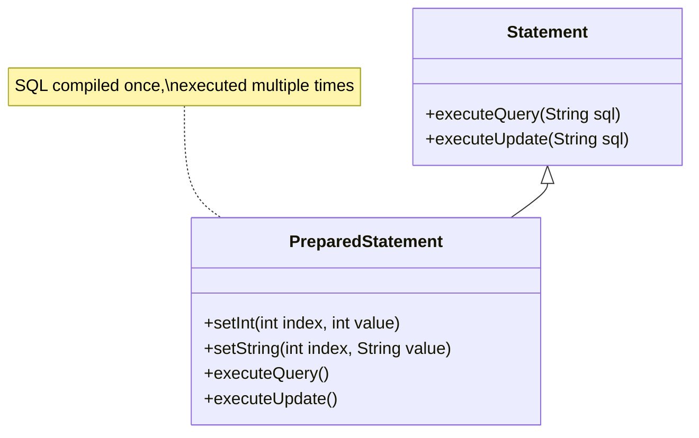
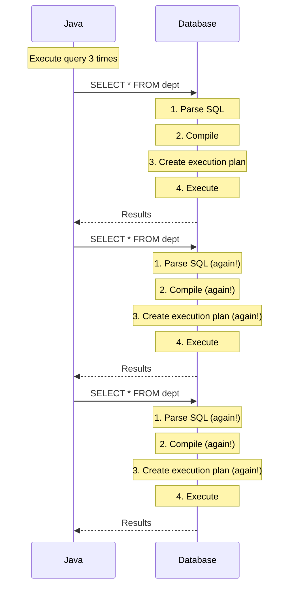
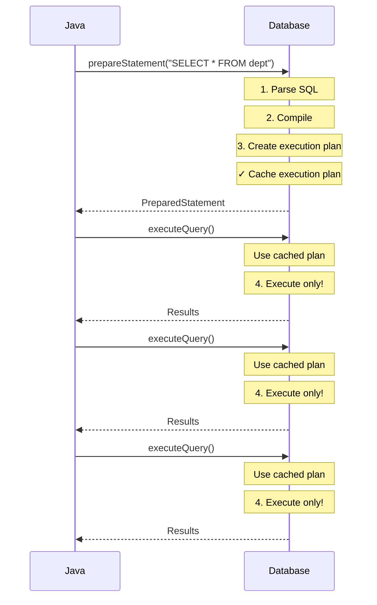

# 06 - PreparedStatement Deep Dive

## Table of Contents
1. [What is PreparedStatement?](#what-is-preparedstatement)
2. [Advantages](#advantages)
3. [Statement vs PreparedStatement](#statement-vs-preparedstatement)
4. [App4: SELECT with PreparedStatement](#app4-select-with-preparedstatement)
5. [App5: UPDATE with Placeholders](#app5-update-with-placeholders)
6. [Parameter Setting](#parameter-setting)
7. [Key Takeaways](#key-takeaways)

---

## What is PreparedStatement?

**PreparedStatement** is an interface (extends Statement) that represents a **precompiled SQL statement**.



---

## Advantages

### PreparedStatement has 2 Main Advantages

#### 1. Placeholders for Dynamic Values

**Problem with Statement**:
```java
// Values hardcoded in SQL
Statement st = con.createStatement();
st.executeUpdate("UPDATE dept SET loc='Mumbai' WHERE deptno=1");

// To change values, must create NEW query
st.executeUpdate("UPDATE dept SET loc='Delhi' WHERE deptno=2");
```

**Solution with PreparedStatement**:
```java
// Use placeholders (?)
PreparedStatement pst = con.prepareStatement("UPDATE dept SET loc=? WHERE deptno=?");

// Set values dynamically
pst.setString(1, "Mumbai");
pst.setInt(2, 1);
pst.executeUpdate();

// Reuse same statement with different values
pst.setString(1, "Delhi");
pst.setInt(2, 2);
pst.executeUpdate();
```

---

#### 2. Precompiled SQL (Performance)

### How Statement Works (Slow)



**Every execution repeats all steps!**

---

### How PreparedStatement Works (Fast)



**Parse, compile, plan creation happen ONCE!**

---

### Performance Comparison

```java
// Statement - parse/compile/plan EVERY time
Statement st = con.createStatement();
st.executeQuery("select * from dept");  // Parse → Compile → Plan → Execute
st.executeQuery("select * from dept");  // Parse → Compile → Plan → Execute
st.executeQuery("select * from dept");  // Parse → Compile → Plan → Execute

// PreparedStatement - parse/compile/plan ONCE
PreparedStatement pst = con.prepareStatement("select * from dept");
                                           // Parse → Compile → Plan (cached)
pst.executeQuery();  // Execute only (uses cached plan)
pst.executeQuery();  // Execute only (uses cached plan)
pst.executeQuery();  // Execute only (uses cached plan)
```

---

## Statement vs PreparedStatement

### Detailed Comparison

| Aspect | Statement | PreparedStatement |
|--------|-----------|-------------------|
| **SQL** | Passed at execution time | Passed at creation time |
| **Compilation** | Every execution | Once (at preparation) |
| **Performance** | Slower (repeated compilation) | Faster (cached plan) |
| **Parameters** | None (hardcoded values) | Placeholders (?) |
| **SQL Injection** | Vulnerable | Protected |
| **Reusability** | Create new each time | Reuse with different values |
| **Best For** | One-time queries | Repeated queries |

### Syntax Differences

**Statement**:
```java
Statement st = con.createStatement();
ResultSet rs = st.executeQuery("SELECT * FROM dept WHERE deptno=1");
int rows = st.executeUpdate("UPDATE dept SET loc='Mumbai' WHERE deptno=1");
```

**PreparedStatement**:
```java
PreparedStatement pst = con.prepareStatement("SELECT * FROM dept WHERE deptno=?");
pst.setInt(1, 1);
ResultSet rs = pst.executeQuery();  // No SQL parameter!

PreparedStatement pst2 = con.prepareStatement("UPDATE dept SET loc=? WHERE deptno=?");
pst2.setString(1, "Mumbai");
pst2.setInt(2, 1);
int rows = pst2.executeUpdate();  // No SQL parameter!
```

---

## App4: SELECT with PreparedStatement

### Complete Code

```java
import java.sql.*;

public class App4 {
    public static void main(String args[]) {
        String ss = "jdbc:mysql://localhost:3306/mydb";
        try(Connection con = DriverManager.getConnection(ss, "root", "root")) {
            System.out.println("Implementation class is\t" + con.getClass());
            
            PreparedStatement pst = con.prepareStatement("select * from dept");
            ResultSet rs = pst.executeQuery();
            
            while(rs.next()) {
                int  no = rs.getInt("deptno");
                String name = rs.getString("dname");
                String loc = rs.getString("loc");
                System.out.println(no + "\t" + name + "\t" + loc);
            }
        }
        catch(Exception ee) {
            System.out.println(ee);
        }
    }
}
```

### Key Line E planations

#### Line 9: Create PreparedStatement
```java
PreparedStatement pst = con.prepareStatement("select * from dept");
```

**What happens**:
1. `con.prepareStatement(...)` - Method on Connection interface
2. **Parameter**: SQL query as String (complete SQL, no placeholders in this example)
3. **Process**:
   - a) SQL sent to database
   - b) Database **parses** the SQL
   - c) Database **compiles** the SQL
   - d) Database creates **execution plan**
   - e) Execution plan **cached** by database
4. **Returns**: PreparedStatement object
5. **Stored in**: variable `pst`

**Key Difference from Statement**:
- Statement: SQL given at execute time
- PreparedStatement: SQL given at prepare time

---

#### Line 10: Execute Query
```java
ResultSet rs = pst.executeQuery();
```

**Important**: Notice **NO SQL parameter**!

**Comparison**:
```java
// Statement - SQL at execution
ResultSet rs = st.executeQuery("select * from dept");

// PreparedStatement - SQL already prepared
ResultSet rs = pst.executeQuery();  // No parameter!
```

**What happens**:
1. `pst.executeQuery()` - No SQL needed, already prepared
2. Database uses **cached execution plan**
3. Skips parse, compile, plan creation
4. **Executes immediately**
5. Returns ResultSet with results

**Performance Benefit**: If you call `pst.executeQuery()` again, it executes instantly using cached plan!

---

#### Lines 12-17: Process ResultSet
```java
while(rs.next()) {
    int  no = rs.getInt("deptno");
    String name = rs.getString("dname");
    String loc = rs.getString("loc");
    System.out.println(no + "\t" + name + "\t" + loc);
}
```

**Same as Statement** - ResultSet processing is identical!

---

##5: UPDATE with Placeholders

### Complete Code

```java
import java.sql.*;

public class App5 {
    public static void main(String args[]) {
        String ss = "jdbc:mysql://localhost:3306/mydb";
        try(Connection con = DriverManager.getConnection(ss, "root", "root")) {
            System.out.println("Implementation class is\t" + con.getClass());
            
            PreparedStatement pst = con.prepareStatement("update dept set loc=?");
            pst.setString(1, "delhi");  // Replace 1st question mark with "delhi"
            
            int mod = pst.executeUpdate();
            
            if(mod > 0) {
                System.out.println("Records are successfully added");
            }
        }
        catch(Exception ee) {
            System.out.println(ee);
        }
    }
}
```

### Key Line Explanations

#### Line 9: Prepare with Placeholder
```java
PreparedStatement pst = con.prepareStatement("update dept set loc=?");
```

**Explanation**:
- SQL: `"update dept set loc=?"`
  - `?` is a **placeholder** (parameter marker)
  - Position: 1st placeholder (index 1)
- **Process**:
  - Database understands structure: "UPDATE dept table, SET loc column to some value"
  - Does NOT know what value yet
  - Prepares execution plan with placeholder
- **Returns**: PreparedStatement with one parameter

**Visual**:
```
SQL Template: update dept set loc = [?]
                                     ↑
                                   Index 1
```

---

#### Line 10: Set Parameter Value
```java
pst.setString(1, "delhi");  // Replace 1st question mark with "delhi"
```

**Explanation**:
- `pst.setString(...)` - Method to set String parameter
- **Parameter 1**: `1` - Index of placeholder (1st ?)
- **Parameter 2**: `"delhi"` - Value to use
- **Effect**: Replaces `?` with `"delhi"`

**After this line**:
```
SQL becomes: update dept set loc = 'delhi'
```

**Index is 1-based**:
- 1st `?` → index 1
- 2nd `?` → index 2
- 3rd `?` → index 3
- etc.

---

#### Line 12: Execute Update
```java
int mod = pst.executeUpdate();
```

**Explanation**:
- `pst.executeUpdate()` - Executes the prepared UPDATE
- **No SQL parameter** (already prepared!)
- Uses cached execution plan
- Substitutes "delhi" for `?`
- Returns: number of rows affected

---

### Multiple Placeholders Example

```java
// SQL with 2 placeholders
PreparedStatement pst = con.prepareStatement(
    "UPDATE dept SET loc=? WHERE deptno=?"
);

// Set both parameters
pst.setString(1, "Mumbai");  // First ? = "Mumbai"
pst.setInt(2, 3);            // Second ? = 3

// Execute
int rows = pst.executeUpdate();

// Becomes: UPDATE dept SET loc='Mumbai' WHERE deptno=3
```

**Visual**:
```
SQL Template: UPDATE dept SET loc = [?] WHERE deptno = [?]
                                     ↑                  ↑
                                  Index 1            Index 2
```

---

## Parameter Setting

### setXXX() Methods

PreparedStatement provides methods to set parameters of different types:

| Method | Type | Example |
|--------|------|---------|
| `setInt(int index, int value)` | Integer | `pst.setInt(1, 100)` |
| `setString(int index, String value)` | String | `pst.setString(1, "Mumbai")` |
| `setDouble(int index, double value)` | Double | `pst.setDouble(1, 50000.50)` |
| `setBoolean(int index, boolean value)` | Boolean | `pst.setBoolean(1, true)` |
| `setDate(int index, Date value)` | Date | `pst.setDate(1, new Date(...))` |
| `setNull(int index, int sqlType)` | NULL | `pst.setNull(1, Types.VARCHAR)` |

### Complete Example with Multiple Parameters

```java
import java.sql.*;

public class InsertExample {
    public static void main(String[] args) {
        String url = "jdbc:mysql://localhost:3306/mydb";
        String sql = "INSERT INTO employee(empno, ename, salary, hiredate, active) VALUES(?, ?, ?, ?, ?)";
        
        try(Connection con = DriverManager.getConnection(url, "root", "root");
            PreparedStatement pst = con.prepareStatement(sql)) {
            
            // Set all 5 parameters
            pst.setInt(1, 101);                              // empno
            pst.setString(2, "John Doe");                    // ename
            pst.setDouble(3, 75000.00);                      // salary
            pst.setDate(4, new java.sql.Date(System.currentTimeMillis())); // hiredate
            pst.setBoolean(5, true);                         // active
            
            int rows = pst.executeUpdate();
            System.out.println(rows + " row inserted");
            
        } catch(SQLException e) {
            e.printStackTrace();
        }
    }
}
```

---

### Parameter Index Rules

1. **1-based**: First parameter is index 1 (NOT 0!)
2. **Must set ALL parameters**: Cannot execute with unset parameters
3. **Type safety**: Use appropriate setXXX() for column type
4. **Reusable**: Can reset parameters and execute again

**Example**:
```java
PreparedStatement pst = con.prepareStatement("UPDATE dept SET loc=? WHERE deptno=?");

// First execution
pst.setString(1, "Mumbai");
pst.setInt(2, 1);
pst.executeUpdate();

// Second execution - reuse same PreparedStatement
pst.setString(1, "Delhi");
pst.setInt(2, 2);
pst.executeUpdate();

// Third execution
pst.setString(1, "Bangalore");
pst.setInt(2, 3);
pst.executeUpdate();

// SQL only parsed/compiled ONCE!
// Executions 2 and 3 are very fast!
```

---

## Key Takeaways

### PreparedStatement Advantages
1. **Performance**: Precompiled SQL, execution plan cached
2. **Security**: Protection against SQL injection
3. **Reusability**: Same statement, different parameters
4. **Readability**: Clearer separation of SQL and data

### When to Use PreparedStatement
✅ **Always use for**:
- Queries with user input
- Queries executed multiple times
- INSERT/UPDATE/DELETE operations
- Security-critical applications

✅ **Statement OK for**:
- One-time queries
- Static SQL (no parameters)
- DDL statements (CREATE, DROP, ALTER)

### Syntax Reminders
```java
// Preparation - SQL with placeholders
PreparedStatement pst = con.prepareStatement("UPDATE dept SET loc=? WHERE id=?");

// Set parameters (1-based index)
pst.setString(1, "Mumbai");
pst.setInt(2, 10);

// Execute (NO SQL parameter)
int rows = pst.executeUpdate();
```

### Performance Impact
- **Statement**: Parse + Compile + Plan + Execute (EVERY time)
- **PreparedStatement**: Parse + Compile + Plan (ONCE), then Execute only

### Best Practices
1. Use PreparedStatement by default
2. Close PreparedStatement when done (or use try-with-resources)
3. Set ALL parameters before executing
4. Reuse PreparedStatement for batch operations
5. Never concatenate user input into SQL!

---

**Next**: [07 - CallableStatement and Procedures](./07_CallableStatement_and_Procedures.md)

Now let's learn how to call database stored procedures from Java!
