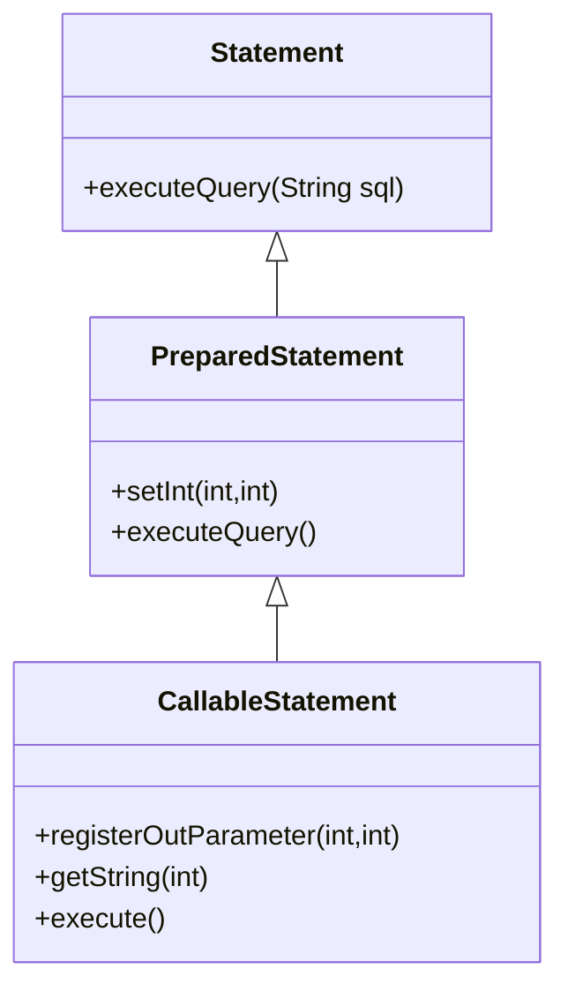
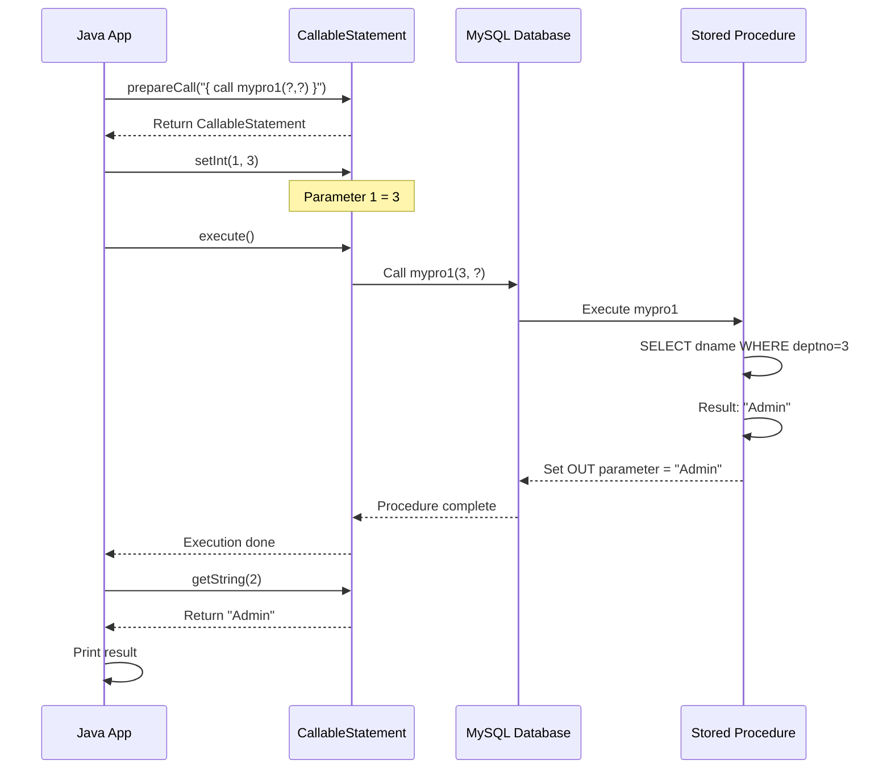

# 07 - CallableStatement and Stored Procedures

## Table of Contents
1. [What is CallableStatement?](#what-is-callablestatement)
2. [Stored Procedures Overview](#stored-procedures-overview)
3. [Creating MySQL Procedures](#creating-mysql-procedures)
4. [App6: Calling Stored Procedures](#app6-calling-stored-procedures)
5. [Parameter Types](#parameter-types)
6. [Key Takeaways](#key-takeaways)

---

## What is CallableStatement?

**CallableStatement** is an interface used to **execute stored procedures and functions** in the database.



**Hierarchy**: `CallableStatement` extends `PreparedStatement` which extends `Statement`

---

## Stored Procedures Overview

### What is a Stored Procedure?

A **stored procedure** is a **precompiled SQL code** stored in the database that can be executed repeatedly.

**Benefits**:
- ✅ **Performance**: Precompiled, executes faster
- ✅ **Reusability**: Write once, call many times
- ✅ **Security**: Encapsulate business logic
- ✅ **Network efficiency**: Less data transferred
- ✅ **Centralized logic**: Database handles processing

---

## Creating MySQL Procedures

### Example 1: Procedure with IN and OUT Parameters

#### MySQL Procedure Creation
```sql
DELIMITER //

CREATE PROCEDURE mypro1(
    IN dno INT,           -- Input parameter
    OUT dname VARCHAR(20) -- Output parameter
)
BEGIN
    SELECT d.dname INTO dname 
    FROM dept d 
    WHERE d.deptno = dno;
END //

DELIMITER ;
```

**Explanation**:
- `DELIMITER //` - Changes delimiter to // (so ; can be used inside procedure)
- `IN dno INT` - Input parameter (we provide value)
- `OUT dname VARCHAR(20)` - Output parameter (procedure returns value)
- `SELECT ... INTO dname` - Stores query result into output parameter
- `DELIMITER ;` - Restores default delimiter

---

### Example 2: Procedure for INSERT

#### MySQL Procedure
```sql
DELIMITER //

CREATE OR REPLACE PROCEDURE mypro(
    name IN VARCHAR(20),
    place IN VARCHAR(30)
)
BEGIN
    INSERT INTO dept(dname, loc) VALUES(name, place);
END //

DELIMITER ;
```

**Oracle Syntax**:
```sql
CREATE OR REPLACE PROCEDURE mypro  
(no IN NUMBER,  
 name IN VARCHAR2,
 place IN VARCHAR2)  
IS  
BEGIN  
    INSERT INTO dept VALUES(no, name, place);  
END;  
/
```

---

## App6: Calling Stored Procedures

### Complete Code

```java
import java.sql.*;

public class App6 {
    public static void main(String args[]) {
        String ss = "jdbc:mysql://localhost:3306/mydb";
        try(Connection con = DriverManager.getConnection(ss, "root", "root")) {
            
            CallableStatement cst = con.prepareCall("{ call mypro1(?,?) }");
            cst.setInt(1, 3);
            cst.execute();
            String name = cst.getString(2);
            
            System.out.println("dept.name retrieved is  " + name);
        }
        catch(Exception ee) {
            System.out.println(ee);
        }
    }
}
```

---

### Line-by-Line Explanation

#### Line 8: Create CallableStatement
```java
CallableStatement cst = con.prepareCall("{ call mypro1(?,?) }");
```

**Explanation**:
- `con.prepareCall(...)` - Method to create CallableStatement
- Parameter: `"{ call mypro1(?,?) }"` - Stored procedure call syntax
  - `{ call ... }` - Standard JDBC escape syntax
  - `mypro1` - Procedure name
  - `(?,?)` - Two parameters (both represented by ?)
- Returns: CallableStatement object
- Stored in: variable `cst`

**Syntax Variations**:
```java
// MySQL/Standard
"{ call procedureName(?,?,?) }"

// For functions (return value)
"{ ? = call functionName(?,?) }"
```

**What this means**:
- "mypro1" is a procedure with **2 arguments**
- 1st argument: IN parameter (input)
- 2nd argument: OUT parameter (output)

---

#### Line 9: Set Input Parameter
```java
cst.setInt(1, 3);
```

**Explanation**:
- `cst.setInt(1, 3)` - Sets the 1st parameter
- **Parameter 1**: `1` - Index (1st ?)
- **Parameter 2**: `3` - Value to pass
- **Effect**: Pass 3 as input to procedure's  `dno` parameter

**Procedure execution will**:
```sql
SELECT d.dname INTO dname FROM dept WHERE d.deptno = 3
```

**Why setInt?**
- 1st argument of "mypro1" is `IN dno INT`
- Type is `int`, so we use `setInt()`

---

#### Line 10: Execute Procedure
```java
cst.execute();
```

**Explanation**:
- `cst.execute()` - Executes the stored procedure
- **No parameters** (already set with setInt)
- **Process**:
  1. Calls mypro1 with dno=3
  2. Procedure queries database
  3. Finds department with deptno=3 (e.g., "Admin")
  4. Stores "Admin" in OUT parameter (2nd ?)
  5. Returns control to Java

**After this line**: OUT parameter contains the result

---

#### Line 11: Get Output Parameter
```java
String name = cst.getString(2);
```

**Explanation**:
- `cst.getString(2)` - Retrieves the 2nd parameter value
- **Parameter**: `2` - Index of OUT parameter
- **Returns**: String value from procedure
- **Stored in**: variable `name`

**Why getString?**
- 2nd argument of "mypro1" is `OUT dname VARCHAR(20)`
- Type is `VARCHAR`, so we use `getString()`

**Process**:
1. Procedure executed, OUT parameter populated
2. `getString(2)` retrieves that value
3. Example: If deptno=3 has dname="Admin", name becomes "Admin"

---

#### Line 13: Print Result
```java
System.out.println("dept.name retrieved is  " + name);
```

**Output**: `dept.name retrieved is  Admin`

---

### Execution Flow



---

## Parameter Types

### IN, OUT, and INOUT

| Type | Direction | Set in Java | Retrieve in Java | Use Case |
|------|-----------|-------------|------------------|----------|
| **IN** | Java → Database | `setXXX()` | - | Pass values to procedure |
| **OUT** | Database → Java | `registerOutParameter()` | `getXXX()` | Get results from procedure |
| **INOUT** | Both ways | `setXXX()` + `registerOutParameter()` | `getXXX()` | Pass and receive values |

---

### IN Parameters

**Definition**: Values passed FROM Java TO database

**Example**:
```java
// Procedure: INSERT INTO dept VALUES(?, ?)
CallableStatement cst = con.prepareCall("{ call insertDept(?, ?) }");
cst.setInt(1, 10);          // IN: dept number
cst.setString(2, "Sales");  // IN: dept name
cst.execute();
```

---

### OUT Parameters

**Definition**: Values returned FROM database TO Java

**Must register before execution**:
```java
// Procedure has OUT parameter
CallableStatement cst = con.prepareCall("{ call getDeptName(?, ?) }");
cst.setInt(1, 3);                          // IN parameter
cst.registerOutParameter(2, Types.VARCHAR); // OUT parameter
cst.execute();
String result = cst.getString(2);           // Retrieve OUT value
```

**registerOutParameter()**:
- **Parameter 1**: Index of OUT parameter
- **Parameter 2**: SQL type (from `java.sql.Types`)
- **Purpose**: Tells driver to expect output at that position

---

### INOUT Parameters

**Definition**: Parameter is both input and output

**Example**:
```sql
-- Procedure doubles the input value
CREATE PROCEDURE doubleValue(INOUT val INT)
BEGIN
    SET val = val * 2;
END;
```

**Java code**:
```java
CallableStatement cst = con.prepareCall("{ call doubleValue(?) }");
cst.setInt(1, 5);                       // Set input value
cst.registerOutParameter(1, Types.INTEGER); // Register for output
cst.execute();
int result = cst.getInt(1);             // Get output value (10)
```

---

### Complete Example with Multiple Parameter Types

```java
// Procedure signature:
// procedure updateAndReturn(
//     IN empId INT,
//     IN newSalary DOUBLE,
//     OUT oldSalary DOUBLE,
//     OUT empName VARCHAR(50)
// )

CallableStatement cst = con.prepareCall("{ call updateAndReturn(?, ?, ?, ?) }");

// Set IN parameters
cst.setInt(1, 101);          // empId
cst.setDouble(2, 75000.00);  // newSalary

// Register OUT parameters
cst.registerOutParameter(3, Types.DOUBLE);  // oldSalary
cst.registerOutParameter(4, Types.VARCHAR); // empName

// Execute
cst.execute();

// Retrieve OUT parameters
double oldSal = cst.getDouble(3);
String name = cst.getString(4);

System.out.println("Employee: " + name);
System.out.println("Old Salary: " + oldSal);
System.out.println("New Salary: 75000.00");
```

---

## Key Takeaways

### CallableStatement Basics
- **Purpose**: Execute stored procedures/functions
- **Created with**: `con.prepareCall("{ call procName(?, ?) }")`
- **Extends**: PreparedStatement (inherits parameter setting)

### Parameter Handling
1. **IN parameters**: Use setXXX() methods
2. **OUT parameters**: Register with registerOutParameter(), retrieve with getXXX()
3. **INOUT parameters**: Both set and register

### CallableStatement vs PreparedStatement

| Feature | PreparedStatement | CallableStatement |
|---------|-------------------|-------------------|
| **Purpose** | Execute SQL statements | Execute stored procedures |
| **Creation** | `prepareStatement(sql)` | `prepareCall("{ call ... }")` |
| **Parameters** | IN only (setXXX) | IN, OUT, INOUT |
| **Retrieval** | Via ResultSet | Via getXXX() on statement |
| **Performance** | Good (precompiled SQL) | Better (database-side logic) |

### When to Use Stored Procedures
✅ **Good for**:
- Complex business logic
- Operations on multiple tables
- Frequently executed operations
- Security-sensitive operations
- Performance-critical batch processing

❌ **Avoid for**:
- Simple CRUD operations
- Frequently changing logic
- Platform portability requirements
- Small, one-time queries

### Oracle vs MySQL Procedure Syntax

**Oracle**:
```java
cst = con.prepareCall("{call mypro(?,?,?)}");
```

**MySQL**:
```java
cst = con.prepareCall("{ call mypro(?,?,?) }");  // Spaces in { call }
```

### Best Practices
1. Always close CallableStatement (use try-with-resources)
2. Register ALL OUT parameters before execute()
3. Match setXXX() types with procedure parameter types
4. Handle exceptions appropriately
5. Document procedure contracts clearly

---

**Next**: [08 - Scrollable and Updatable ResultSet](./08_Scrollable_and_Updatable_ResultSet.md)

Learn how to navigate ResultSet in any direction and update database records directly through ResultSet!
